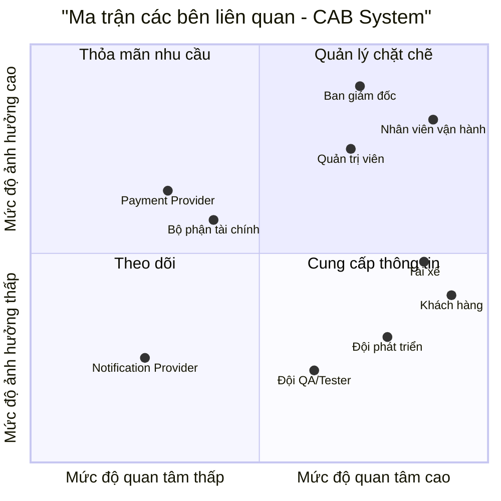
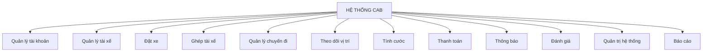
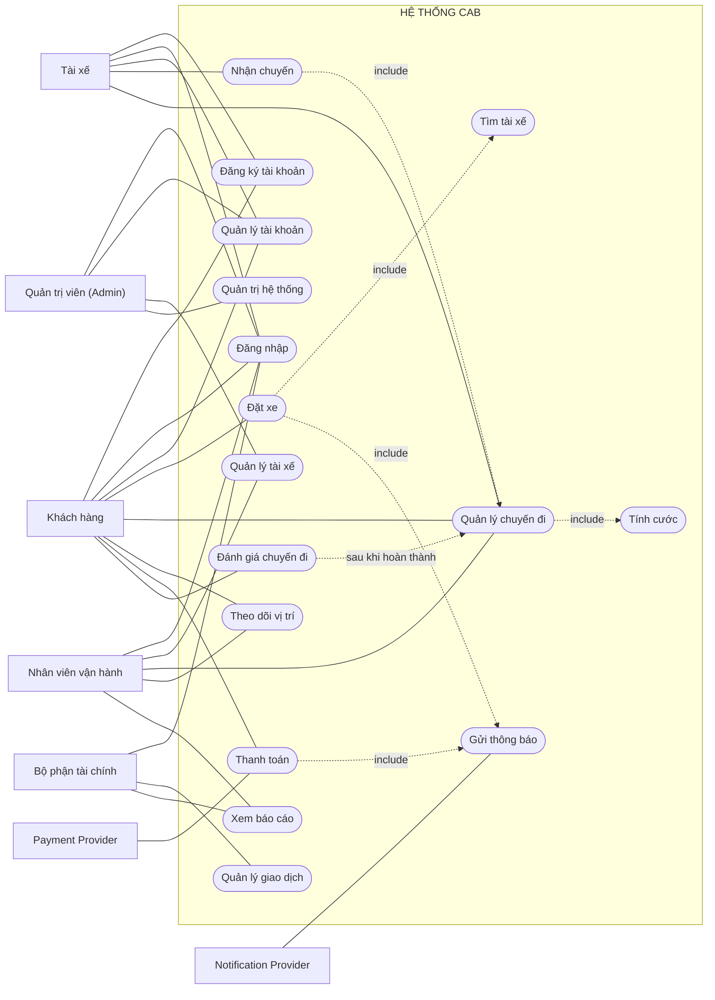

# 23645591_NGUYENHIEUTHIEN_CABSYSTEM

# BƯỚC 1: TÌM HIỂU NGHIỆP VỤ

## 1.1. Tổng quan nghiệp vụ

**CAB System** là hệ thống đặt xe trực tuyến của Công ty ABC, được xây dựng nhằm thay thế một phần quy trình điều phối thủ công bằng quy trình đặt xe và điều phối tự động.

### Luồng nghiệp vụ chính

**Đặt xe → Tìm tài xế → Nhận chuyến → Thực hiện chuyến → Tính cước → Thanh toán → Đánh giá**

## 1.2. Các nghiệp vụ chính

- **Khách hàng:** Đăng ký/đăng nhập, nhập điểm đi và điểm đến, chọn loại xe, đặt xe, theo dõi tài xế và trạng thái chuyến đi, thanh toán và đánh giá chuyến.
- **Tài xế:** Quản lý hồ sơ và phương tiện, chuyển trạng thái sẵn sàng/không sẵn sàng, nhận hoặc từ chối chuyến, cập nhật trạng thái chuyến và gửi vị trí hiện tại.
- **Bộ phận vận hành:** Theo dõi các chuyến đang diễn ra, quản lý thông tin khách hàng/tài xế/phương tiện, hỗ trợ xử lý chuyến lỗi và tra cứu lịch sử.
- **Hệ thống:** Tiếp nhận yêu cầu đặt xe, tìm và ghép tài xế, chuyển sang tài xế khác khi cần, tính cước, xử lý thanh toán, gửi thông báo và tổng hợp số liệu vận hành.

## 1.3. Vấn đề cần thay đổi

Hệ thống/quy trình hiện tại còn phụ thuộc nhiều vào thao tác thủ công, khách hàng thiếu khả năng theo dõi chuyến theo thời gian thực, dữ liệu giao dịch chưa tập trung và khó đảm bảo khả năng mở rộng khi nhu cầu tăng.

Vì vậy, cần chuyển sang một hệ thống có khả năng tự động hóa các nghiệp vụ cốt lõi, đồng thời tăng khả năng giám sát và kiểm soát dữ liệu.

## 1.4. Một số câu hỏi cần BA làm rõ

1. Khi ghép tài xế, doanh nghiệp ưu tiên tiêu chí nào: khoảng cách, thời gian chờ hay điểm đánh giá?
2. Tài xế có bao nhiêu giây để phản hồi trước khi hệ thống chuyển sang tài xế khác?
3. Công thức tính cước và chính sách hủy chuyến cụ thể như thế nào?
4. Khi thanh toán điện tử thất bại, khách hàng có được chuyển sang tiền mặt không?
5. Dữ liệu lịch sử chuyến đi và vị trí GPS cần được lưu trong bao lâu?

---

# BƯỚC 2: XÁC ĐỊNH CÁC BÊN LIÊN QUAN (STAKEHOLDERS)

## 2.1. Bảng Stakeholder và Vai trò

| STT | Stakeholder | Vai trò trong hệ thống | Kỳ vọng chính |
|---:|---|---|---|
| 1 | **Ban giám đốc** | Định hướng mục tiêu, ngân sách và hiệu quả kinh doanh | Hệ thống ổn định, có khả năng mở rộng, báo cáo chính xác |
| 2 | **Nhân viên vận hành** | Giám sát, điều phối và xử lý sự cố | Dashboard trực quan, dữ liệu cập nhật nhanh, xử lý sự cố thuận tiện |
| 3 | **Quản trị viên (Admin)** | Quản lý tài khoản, phân quyền và cấu hình | Bảo mật, phân quyền rõ ràng, có Audit Log |
| 4 | **Tài xế** | Nhận và thực hiện chuyến | Nhận chuyến phù hợp, thao tác đơn giản, cập nhật trạng thái nhanh |
| 5 | **Khách hàng** | Đặt xe, theo dõi, thanh toán và đánh giá | Đặt xe nhanh, minh bạch giá và thông tin tài xế |
| 6 | **Bộ phận tài chính** | Theo dõi doanh thu và đối soát | Dữ liệu giao dịch tập trung, chính xác |
| 7 | **Payment Provider** | Cung cấp dịch vụ thanh toán điện tử | API ổn định, giao dịch an toàn |
| 8 | **Notification Provider** | Cung cấp dịch vụ gửi thông báo | Gửi thông báo nhanh và ổn định |
| 9 | **Đội phát triển (Dev)** | Phân tích, thiết kế, xây dựng và triển khai | Yêu cầu rõ ràng, kiến trúc phù hợp, hoàn thành đúng 7 tuần |
| 10 | **Đội QA/Tester** | Kiểm thử chức năng và chất lượng hệ thống | Yêu cầu và tiêu chí nghiệm thu rõ ràng |

## 2.2. Stakeholder Matrix

### 2.2.1. Phân loại theo Quyền lực / Mức độ quan tâm

- **Quản lý chặt chẽ:** Ban giám đốc, Nhân viên vận hành, Quản trị viên.
- **Thỏa mãn nhu cầu:** Bộ phận tài chính, Payment Provider.
- **Theo dõi:** Notification Provider.
- **Cung cấp thông tin:** Khách hàng, Tài xế, Đội phát triển, Đội QA/Tester.

### 2.2.2. Ma trận các bên liên quan

## 2.3. Chiến lược quản lý Stakeholder

| Nhóm | Stakeholder | Cách quản lý |
|---|---|---|
| **Quản lý chặt chẽ** | Ban giám đốc, Nhân viên vận hành, Quản trị viên | Trao đổi thường xuyên, xác nhận yêu cầu, ưu tiên chức năng và theo dõi tiến độ |
| **Thỏa mãn nhu cầu** | Bộ phận tài chính, Payment Provider | Cập nhật theo các mốc quan trọng, thống nhất yêu cầu nghiệp vụ và yêu cầu tích hợp |
| **Theo dõi** | Notification Provider | Theo dõi khả năng đáp ứng, tình trạng tích hợp và xử lý khi có lỗi |
| **Cung cấp thông tin** | Khách hàng, Tài xế, Đội phát triển (Dev), Đội QA/Tester | Thu thập phản hồi, cung cấp thông tin cần thiết và phối hợp trong quá trình phát triển hệ thống |
# BƯỚC 3: MỤC ĐÍCH NGHIỆP VỤ (BUSINESS PURPOSE & GOALS)

## 3.1. Mục đích nghiệp vụ

CAB System được xây dựng nhằm **tự động hóa quy trình đặt xe và điều phối chuyến**, giảm sự phụ thuộc vào thao tác thủ công và nâng cao hiệu quả vận hành.

Hệ thống hướng đến việc quản lý tập trung toàn bộ quy trình:

**Đặt xe → Tìm tài xế → Nhận chuyến → Thực hiện chuyến → Tính cước → Thanh toán → Đánh giá**

Đồng thời, hệ thống cung cấp khả năng theo dõi trạng thái chuyến đi, quản lý thông tin khách hàng và tài xế, xử lý thanh toán, gửi thông báo và hỗ trợ quản lý dữ liệu vận hành.

## 3.2. Mục tiêu nghiệp vụ

| STT | Mục tiêu | Mô tả |
|---:|---|---|
| 1 | **Tự động hóa đặt xe** | Cho phép khách hàng chủ động tạo yêu cầu đặt xe thông qua hệ thống. |
| 2 | **Tự động ghép tài xế** | Tìm kiếm và ghép tài xế phù hợp với yêu cầu chuyến đi. |
| 3 | **Theo dõi chuyến đi** | Cho phép khách hàng và bộ phận vận hành theo dõi trạng thái chuyến đi. |
| 4 | **Quản lý tài xế** | Quản lý thông tin, trạng thái hoạt động và quá trình thực hiện chuyến của tài xế. |
| 5 | **Tính cước tự động** | Hỗ trợ tính toán chi phí chuyến đi dựa trên các quy tắc tính cước của hệ thống. |
| 6 | **Thanh toán điện tử** | Hỗ trợ xử lý thanh toán và ghi nhận thông tin giao dịch. |
| 7 | **Gửi thông báo** | Gửi thông báo đến khách hàng và tài xế khi có sự kiện liên quan đến chuyến đi. |
| 8 | **Đánh giá chuyến đi** | Cho phép khách hàng đánh giá chất lượng chuyến đi sau khi hoàn thành. |
| 9 | **Quản lý và báo cáo** | Hỗ trợ bộ phận vận hành và quản lý theo dõi dữ liệu, lịch sử và tình hình hoạt động của hệ thống. |

## 3.3. Giá trị mang lại

- **Đối với khách hàng:**
  - Đặt xe thuận tiện và nhanh chóng.
  - Có thể theo dõi trạng thái chuyến đi.
  - Minh bạch thông tin chuyến và chi phí.
  - Có thể thực hiện thanh toán và đánh giá chuyến đi.

- **Đối với tài xế:**
  - Nhận chuyến thông qua hệ thống.
  - Quản lý trạng thái hoạt động.
  - Cập nhật trạng thái và vị trí trong quá trình thực hiện chuyến.

- **Đối với bộ phận vận hành:**
  - Theo dõi và điều phối chuyến tập trung.
  - Hỗ trợ xử lý các chuyến có vấn đề.
  - Tra cứu lịch sử và dữ liệu vận hành.

- **Đối với doanh nghiệp:**
  - Giảm phụ thuộc vào quy trình thủ công.
  - Tập trung hóa dữ liệu.
  - Nâng cao hiệu quả quản lý và vận hành.
  - Tạo nền tảng để mở rộng hệ thống trong tương lai.
  # BƯỚC 4: PHẠM VI DỰ ÁN (PROJECT SCOPE - 7 TUẦN)

## 4.1. Phạm vi trong dự án (In-Scope)

Dự án tập trung xây dựng các chức năng cốt lõi phục vụ quy trình đặt xe và vận hành chuyến đi.

| STT | Phạm vi | Nội dung |
|---:|---|---|
| 1 | **Quản lý tài khoản** | Đăng ký, đăng nhập, quản lý thông tin người dùng và phân quyền. |
| 2 | **Đặt xe** | Khách hàng nhập điểm đi, điểm đến, lựa chọn loại xe và tạo yêu cầu đặt xe. |
| 3 | **Ghép tài xế** | Tìm kiếm và ghép tài xế phù hợp với yêu cầu chuyến đi. |
| 4 | **Quản lý chuyến đi** | Theo dõi và cập nhật trạng thái chuyến từ khi tạo đến khi hoàn thành hoặc hủy. |
| 5 | **Theo dõi vị trí** | Cập nhật và hiển thị vị trí tài xế trong quá trình thực hiện chuyến. |
| 6 | **Tính cước** | Tính toán chi phí chuyến đi theo quy tắc của hệ thống. |
| 7 | **Thanh toán** | Hỗ trợ thanh toán và ghi nhận thông tin giao dịch. |
| 8 | **Thông báo** | Gửi thông báo đến khách hàng và tài xế khi có thay đổi liên quan đến chuyến đi. |
| 9 | **Đánh giá** | Cho phép khách hàng đánh giá chuyến đi sau khi hoàn thành. |
| 10 | **Quản trị hệ thống** | Quản lý tài khoản, tài xế, phương tiện và dữ liệu vận hành. |
| 11 | **Báo cáo** | Hỗ trợ theo dõi và tổng hợp dữ liệu phục vụ quản lý và vận hành. |

## 4.2. Phạm vi ngoài dự án (Out-of-Scope)

Các chức năng sau không thuộc phạm vi triển khai trong phiên bản hiện tại:

- Các chức năng nâng cao chưa cần thiết cho phiên bản đầu tiên.
- Các hệ thống hoặc dịch vụ không trực tiếp phục vụ quy trình đặt và thực hiện chuyến.
- Các tính năng mở rộng chưa được ưu tiên trong kế hoạch 7 tuần.
- Các yêu cầu phát sinh ngoài phạm vi đã thống nhất của dự án.

## 4.3. Kế hoạch triển khai trong 7 tuần

| Tuần | Giai đoạn | Công việc chính |
|---:|---|---|
| **Tuần 1** | **Phân tích** | Tìm hiểu nghiệp vụ, xác định Stakeholder, mục tiêu, phạm vi và yêu cầu hệ thống. |
| **Tuần 2** | **Thiết kế** | Thiết kế kiến trúc, cơ sở dữ liệu, các thành phần và giao diện chính của hệ thống. |
| **Tuần 3** | **Phát triển** | Xây dựng các chức năng quản lý tài khoản và các chức năng nền tảng. |
| **Tuần 4** | **Phát triển** | Xây dựng chức năng đặt xe, ghép tài xế và quản lý chuyến đi. |
| **Tuần 5** | **Phát triển** | Xây dựng tính cước, thanh toán, thông báo và các chức năng liên quan. |
| **Tuần 6** | **Kiểm thử** | Kiểm thử chức năng, xử lý lỗi và kiểm tra tính ổn định của hệ thống. |
| **Tuần 7** | **Hoàn thiện** | Hoàn thiện hệ thống, nghiệm thu, hoàn thiện tài liệu và chuẩn bị bàn giao. |

## 4.4. Giới hạn của dự án

- Dự án được thực hiện trong thời gian **7 tuần**.
- Ưu tiên xây dựng các chức năng cốt lõi phục vụ quy trình đặt xe và vận hành.
- Các chức năng mở rộng chỉ được thực hiện khi còn thời gian và nguồn lực.
- Các yêu cầu phát sinh ngoài phạm vi phải được xem xét và đánh giá trước khi đưa vào dự án.
# BƯỚC 5: PHÂN TÍCH YÊU CẦU HỆ THỐNG (REQUIREMENTS ANALYSIS)

## 5.1. Yêu cầu nghiệp vụ (Business Requirements)

| ID | Yêu cầu nghiệp vụ | Mô tả |
|---|---|---|
| **BR-01** | Đặt xe trực tuyến | Khách hàng có thể tạo yêu cầu đặt xe thông qua hệ thống. |
| **BR-02** | Tự động ghép tài xế | Hệ thống tự động tìm và ghép tài xế phù hợp với yêu cầu chuyến đi. |
| **BR-03** | Quản lý chuyến đi | Hệ thống quản lý toàn bộ vòng đời của chuyến đi từ khi tạo đến khi hoàn thành hoặc hủy. |
| **BR-04** | Theo dõi chuyến đi | Khách hàng và bộ phận vận hành có thể theo dõi trạng thái chuyến đi. |
| **BR-05** | Tính cước | Hệ thống tự động tính chi phí chuyến đi theo quy tắc tính cước. |
| **BR-06** | Thanh toán | Hệ thống hỗ trợ xử lý và ghi nhận giao dịch thanh toán. |
| **BR-07** | Thông báo | Hệ thống gửi thông báo đến các bên liên quan khi có sự kiện trong chuyến đi. |
| **BR-08** | Đánh giá chuyến đi | Khách hàng có thể đánh giá chuyến đi sau khi hoàn thành. |
| **BR-09** | Quản lý vận hành | Bộ phận vận hành có thể theo dõi, quản lý và xử lý các vấn đề phát sinh trong quá trình vận hành. |
| **BR-10** | Báo cáo | Hệ thống cung cấp dữ liệu phục vụ việc theo dõi và đánh giá hoạt động kinh doanh. |

## 5.2. Yêu cầu chức năng (Functional Requirements)

| ID | Chức năng | Mô tả |
|---|---|---|
| **FR-AUTH** | Quản lý xác thực | Đăng ký, đăng nhập, đăng xuất và xác thực người dùng. |
| **FR-USER** | Quản lý người dùng | Quản lý thông tin khách hàng, tài xế và các tài khoản liên quan. |
| **FR-DRIVER** | Quản lý tài xế | Quản lý hồ sơ, trạng thái hoạt động và thông tin phương tiện của tài xế. |
| **FR-BOOKING** | Đặt xe | Cho phép khách hàng nhập thông tin chuyến đi và tạo yêu cầu đặt xe. |
| **FR-MATCHING** | Ghép tài xế | Tìm kiếm và ghép tài xế phù hợp với yêu cầu đặt xe. |
| **FR-TRIP** | Quản lý chuyến | Tạo, cập nhật, theo dõi và hoàn tất hoặc hủy chuyến. |
| **FR-GPS** | Theo dõi vị trí | Nhận và cập nhật vị trí của tài xế trong quá trình thực hiện chuyến. |
| **FR-FARE** | Tính cước | Tính toán chi phí chuyến đi dựa trên các quy tắc tính cước. |
| **FR-PAYMENT** | Thanh toán | Xử lý thanh toán và ghi nhận trạng thái giao dịch. |
| **FR-NOTIFICATION** | Thông báo | Gửi thông báo đến khách hàng, tài xế và các bên liên quan. |
| **FR-RATING** | Đánh giá | Cho phép khách hàng đánh giá chuyến đi. |
| **FR-REPORT** | Báo cáo | Cung cấp thông tin và dữ liệu phục vụ quản lý, vận hành. |
| **FR-ADMIN** | Quản trị hệ thống | Quản lý tài khoản, phân quyền và các dữ liệu quản trị. |

## 5.3. Quy tắc nghiệp vụ (Business Rules)

| ID | Quy tắc nghiệp vụ | Mô tả |
|---|---|---|
| **BRULE-01** | Điều kiện đặt xe | Khách hàng phải cung cấp đầy đủ thông tin cần thiết trước khi tạo yêu cầu đặt xe. |
| **BRULE-02** | Ghép tài xế | Hệ thống ưu tiên tài xế phù hợp dựa trên các tiêu chí được doanh nghiệp quy định. |
| **BRULE-03** | Nhận chuyến | Tài xế phải xác nhận nhận chuyến trong khoảng thời gian quy định. |
| **BRULE-04** | Chuyển tài xế | Nếu tài xế từ chối hoặc không phản hồi, hệ thống có thể chuyển yêu cầu sang tài xế khác. |
| **BRULE-05** | Trạng thái chuyến | Chuyến đi phải tuân theo trình tự trạng thái được hệ thống quy định. |
| **BRULE-06** | Tính cước | Chi phí chuyến đi được xác định theo quy tắc tính cước của hệ thống. |
| **BRULE-07** | Thanh toán | Giao dịch phải được ghi nhận với trạng thái tương ứng sau khi hệ thống xử lý thanh toán. |
| **BRULE-08** | Đánh giá | Khách hàng chỉ có thể đánh giá sau khi chuyến đi hoàn thành. |

## 5.4. Ngoại lệ và xử lý ngoại lệ (Exception Handling)

| ID | Tình huống | Cách xử lý |
|---|---|---|
| **EX-01** | Không tìm thấy tài xế | Hệ thống thông báo cho khách hàng và xử lý theo chính sách của doanh nghiệp. |
| **EX-02** | Tài xế từ chối chuyến | Hệ thống tìm và gửi yêu cầu đến tài xế khác. |
| **EX-03** | Tài xế không phản hồi | Sau thời gian quy định, hệ thống chuyển yêu cầu sang tài xế khác. |
| **EX-04** | Thanh toán thất bại | Hệ thống ghi nhận giao dịch thất bại và thông báo cho khách hàng. |
| **EX-05** | Mất kết nối GPS | Hệ thống xử lý trạng thái vị trí và thông báo khi cần thiết. |
| **EX-06** | Hủy chuyến | Hệ thống kiểm tra điều kiện hủy và áp dụng chính sách tương ứng. |

## 5.5. Ưu tiên yêu cầu (MoSCoW)

| Mức độ | Ý nghĩa | Nhóm chức năng |
|---|---|---|
| **Must Have** | Bắt buộc phải có | Đăng nhập, đặt xe, ghép tài xế, quản lý chuyến, tính cước |
| **Should Have** | Nên có | Theo dõi vị trí, thông báo, thanh toán điện tử |
| **Could Have** | Có thể có | Các chức năng nâng cao và cải thiện trải nghiệm |
| **Won't Have** | Chưa thực hiện trong phiên bản hiện tại | Các chức năng mở rộng ngoài phạm vi 7 tuần |

## 5.6. Rủi ro liên quan đến yêu cầu

| ID | Rủi ro | Mức độ ảnh hưởng | Hướng xử lý |
|---|---|---|---|
| **R-01** | Yêu cầu nghiệp vụ chưa rõ ràng | Cao | Làm rõ và xác nhận yêu cầu với Stakeholder. |
| **R-02** | Thay đổi yêu cầu trong quá trình phát triển | Cao | Kiểm soát phạm vi và đánh giá tác động trước khi thay đổi. |
| **R-03** | Phụ thuộc Payment Provider | Trung bình | Xác định rõ yêu cầu tích hợp và phương án xử lý khi dịch vụ lỗi. |
| **R-04** | Phụ thuộc Notification Provider | Trung bình | Có cơ chế xử lý khi dịch vụ thông báo không khả dụng. |
| **R-05** | Dữ liệu GPS không ổn định | Trung bình | Kiểm tra trạng thái kết nối và xử lý khi mất dữ liệu vị trí. |
| **R-06** | Thời gian thực hiện dự án chỉ 7 tuần | Cao | Ưu tiên các chức năng quan trọng và kiểm soát phạm vi dự án. |
# BƯỚC 6: PHÂN RÃ CHỨC NĂNG HỆ THỐNG (FUNCTIONAL DECOMPOSITION)

## 6.1. Bảng phân rã chức năng hệ thống

| STT | Nhóm chức năng | Chức năng |
|---:|---|---|
| 1 | **Quản lý tài khoản** | Đăng ký, đăng nhập, đăng xuất, quản lý thông tin tài khoản và phân quyền |
| 2 | **Quản lý tài xế** | Quản lý hồ sơ tài xế, phương tiện và trạng thái hoạt động |
| 3 | **Đặt xe** | Nhập thông tin chuyến đi, lựa chọn loại xe và tạo yêu cầu đặt xe |
| 4 | **Ghép tài xế** | Tìm kiếm, lựa chọn và ghép tài xế phù hợp với yêu cầu đặt xe |
| 5 | **Quản lý chuyến đi** | Tạo, cập nhật, theo dõi, hoàn thành và hủy chuyến |
| 6 | **Theo dõi vị trí** | Cập nhật và theo dõi vị trí của tài xế trong quá trình thực hiện chuyến |
| 7 | **Tính cước** | Tính toán chi phí chuyến đi theo quy tắc tính cước |
| 8 | **Thanh toán** | Xử lý và ghi nhận giao dịch thanh toán |
| 9 | **Thông báo** | Gửi thông báo về trạng thái chuyến, tài xế và thanh toán |
| 10 | **Đánh giá** | Cho phép khách hàng đánh giá chuyến đi |
| 11 | **Quản trị hệ thống** | Quản lý tài khoản, phân quyền và dữ liệu quản trị |
| 12 | **Báo cáo** | Tổng hợp và cung cấp dữ liệu phục vụ quản lý và vận hành |

## 6.2. Sơ đồ phân rã chức năng

## 6.3. Mối liên hệ giữa yêu cầu và chức năng

| Yêu cầu | Chức năng tương ứng |
|---|---|
| **BR-01: Đặt xe trực tuyến** | Đặt xe |
| **BR-02: Tự động ghép tài xế** | Ghép tài xế |
| **BR-03: Quản lý chuyến đi** | Quản lý chuyến đi |
| **BR-04: Theo dõi chuyến đi** | Theo dõi vị trí, Quản lý chuyến đi |
| **BR-05: Tính cước** | Tính cước |
| **BR-06: Thanh toán** | Thanh toán |
| **BR-07: Thông báo** | Thông báo |
| **BR-08: Đánh giá chuyến đi** | Đánh giá |
| **BR-09: Quản lý vận hành** | Quản trị hệ thống, Quản lý chuyến đi |
| **BR-10: Báo cáo** | Báo cáo |
# BƯỚC 7: VẼ USE CASE TỔNG QUÁT

## 7.1. Các Actor trong hệ thống

| STT | Actor | Vai trò |
|---:|---|---|
| 1 | **Khách hàng** | Đặt xe, theo dõi chuyến đi, thanh toán và đánh giá chuyến. |
| 2 | **Tài xế** | Nhận chuyến, thực hiện chuyến và cập nhật trạng thái chuyến đi. |
| 3 | **Nhân viên vận hành** | Theo dõi, điều phối và xử lý các vấn đề phát sinh trong quá trình vận hành. |
| 4 | **Quản trị viên (Admin)** | Quản lý tài khoản, phân quyền và quản trị hệ thống. |
| 5 | **Bộ phận tài chính** | Theo dõi giao dịch, doanh thu và thực hiện đối soát. |
| 6 | **Payment Provider** | Cung cấp dịch vụ thanh toán điện tử cho hệ thống. |
| 7 | **Notification Provider** | Cung cấp dịch vụ gửi thông báo cho người dùng. |

## 7.2. Các Use Case chính

| STT | Use Case | Actor liên quan |
|---:|---|---|
| 1 | **Đăng ký tài khoản** | Khách hàng, Tài xế |
| 2 | **Đăng nhập** | Khách hàng, Tài xế, Nhân viên vận hành, Admin, Bộ phận tài chính |
| 3 | **Quản lý tài khoản** | Khách hàng, Tài xế, Admin |
| 4 | **Quản lý tài xế** | Admin, Nhân viên vận hành |
| 5 | **Đặt xe** | Khách hàng |
| 6 | **Tìm tài xế** | Hệ thống |
| 7 | **Nhận chuyến** | Tài xế |
| 8 | **Quản lý chuyến đi** | Khách hàng, Tài xế, Nhân viên vận hành |
| 9 | **Theo dõi vị trí** | Khách hàng, Nhân viên vận hành |
| 10 | **Tính cước** | Hệ thống |
| 11 | **Thanh toán** | Khách hàng, Payment Provider |
| 12 | **Gửi thông báo** | Notification Provider |
| 13 | **Đánh giá chuyến đi** | Khách hàng |
| 14 | **Quản lý giao dịch** | Bộ phận tài chính |
| 15 | **Quản trị hệ thống** | Admin |
| 16 | **Xem báo cáo** | Nhân viên vận hành, Bộ phận tài chính |

## 7.3. Use Case Diagram tổng quát

