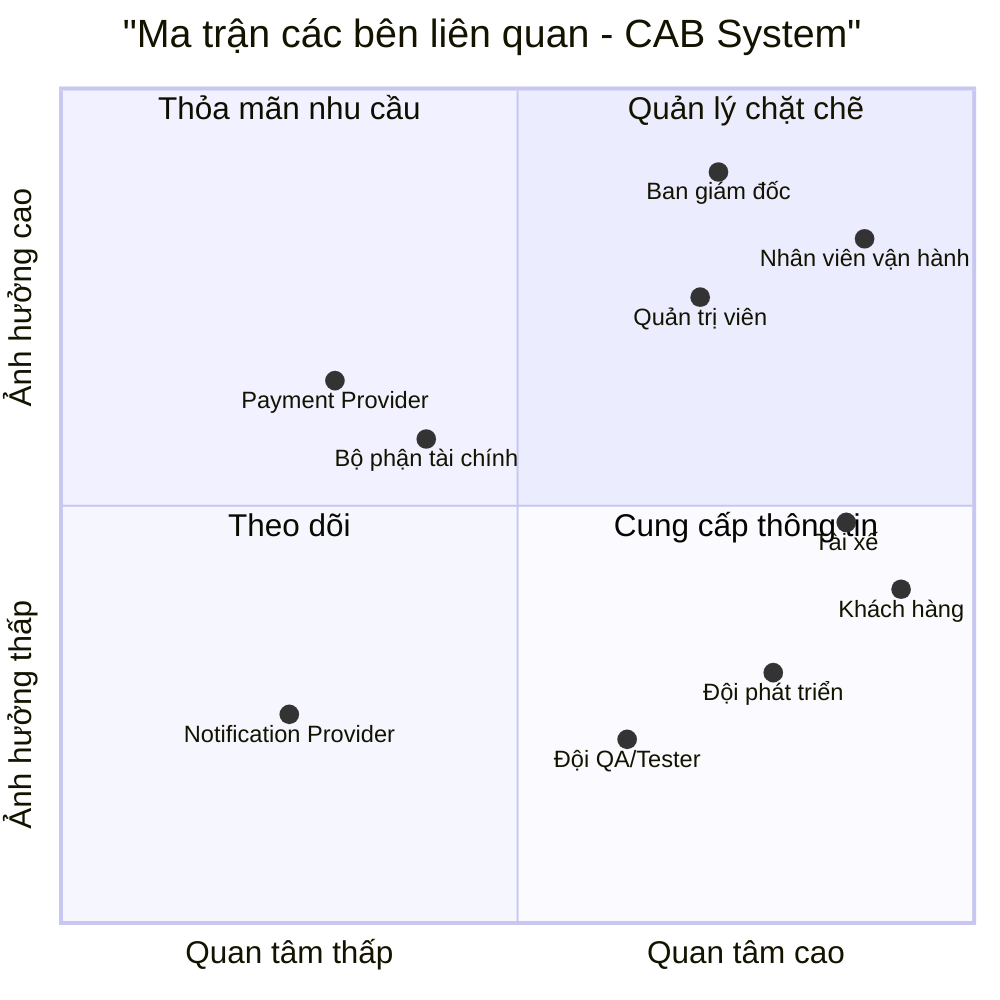

# 23645591_NGUYENHIEUTHIEN_CABSYSTEM

## 1. TÌM HIỂU NGHIỆP VỤ

### 1.1. Tổng quan nghiệp vụ

**CAB System** là hệ thống đặt xe trực tuyến của Công ty ABC, được xây dựng nhằm thay thế một phần quy trình điều phối thủ công bằng quy trình đặt xe và điều phối tự động.

Luồng nghiệp vụ chính:

**Đặt xe → Tìm tài xế → Nhận chuyến → Thực hiện chuyến → Tính cước → Thanh toán → Đánh giá**

### 1.2. Các nghiệp vụ chính

- **Khách hàng:** Đăng ký/đăng nhập, nhập điểm đi và điểm đến, chọn loại xe, đặt xe, theo dõi tài xế và trạng thái chuyến đi, thanh toán và đánh giá chuyến.
- **Tài xế:** Quản lý hồ sơ và phương tiện, chuyển trạng thái sẵn sàng/không sẵn sàng, nhận hoặc từ chối chuyến, cập nhật trạng thái chuyến và gửi vị trí hiện tại.
- **Bộ phận vận hành:** Theo dõi các chuyến đang diễn ra, quản lý thông tin khách hàng/tài xế/phương tiện, hỗ trợ xử lý chuyến lỗi và tra cứu lịch sử.
- **Hệ thống:** Tiếp nhận yêu cầu đặt xe, tìm và ghép tài xế, chuyển sang tài xế khác khi cần, tính cước, xử lý thanh toán, gửi thông báo và tổng hợp số liệu vận hành.

### 1.3. Vấn đề cần thay đổi

Hệ thống/quy trình hiện tại còn phụ thuộc nhiều vào thao tác thủ công, khách hàng thiếu khả năng theo dõi chuyến theo thời gian thực, dữ liệu giao dịch chưa tập trung và khó đảm bảo khả năng mở rộng khi nhu cầu tăng.

Vì vậy, cần chuyển sang một hệ thống có khả năng tự động hóa các nghiệp vụ cốt lõi, đồng thời tăng khả năng giám sát và kiểm soát dữ liệu.

### 1.4. Một số câu hỏi cần BA làm rõ

1. Khi ghép tài xế, doanh nghiệp ưu tiên tiêu chí nào: khoảng cách, thời gian chờ hay điểm đánh giá?
2. Tài xế có bao nhiêu giây để phản hồi trước khi hệ thống chuyển sang tài xế khác?
3. Công thức tính cước và chính sách hủy chuyến cụ thể như thế nào?
4. Khi thanh toán điện tử thất bại, khách hàng có được chuyển sang tiền mặt không?
5. Dữ liệu lịch sử chuyến đi và vị trí GPS cần được lưu trong bao lâu?

---

## 2. XÁC ĐỊNH CÁC BÊN LIÊN QUAN (STAKEHOLDERS)

| STT | Stakeholder | Vai trò trong hệ thống | Kỳ vọng chính |
|---:|---|---|---|
| 1 | **Ban giám đốc** | Định hướng mục tiêu, ngân sách và hiệu quả kinh doanh | Hệ thống ổn định, có khả năng mở rộng, báo cáo chính xác |
| 2 | **Nhân viên vận hành** | Giám sát, điều phối và xử lý sự cố | Dashboard trực quan, dữ liệu cập nhật nhanh, xử lý sự cố thuận tiện |
| 3 | **Quản trị viên (Admin)** | Quản lý tài khoản, phân quyền và cấu hình | Bảo mật, phân quyền rõ ràng, có Audit Log |
| 4 | **Tài xế** | Nhận và thực hiện chuyến | Nhận chuyến phù hợp, thao tác đơn giản, cập nhật trạng thái nhanh |
| 5 | **Khách hàng** | Đặt xe, theo dõi, thanh toán và đánh giá | Đặt xe nhanh, minh bạch giá và thông tin tài xế |
| 6 | **Bộ phận tài chính** | Theo dõi doanh thu và đối soát | Dữ liệu giao dịch tập trung, chính xác |
| 7 | **Payment Provider** | Cung cấp dịch vụ thanh toán điện tử | API ổn định, giao dịch an toàn |
| 8 | **Notification Provider** | Cung cấp dịch vụ gửi thông báo | Gửi thông báo nhanh và ổn định |
| 9 | **Đội phát triển (Dev)** | Phân tích, thiết kế, xây dựng và triển khai | Yêu cầu rõ ràng, kiến trúc phù hợp, hoàn thành đúng 7 tuần |
| 10 | **Đội QA/Tester** | Kiểm thử chức năng và chất lượng hệ thống | Yêu cầu và tiêu chí nghiệm thu rõ ràng |

---

## 3. STAKEHOLDER MATRIX

### 3.1. Phân loại theo Power / Interest

- **Quản lý chặt chẽ:** Ban giám đốc, Nhân viên vận hành, Quản trị viên.
- **Thỏa mãn nhu cầu:** Bộ phận tài chính, Payment Provider.
- **Theo dõi:** Notification Provider.
- **Cung cấp thông tin:** Khách hàng, Tài xế, Đội phát triển, Đội QA/Tester.

### 3.2. Ma trận Stakeholder

### 3.3. Chiến lược quản lý Stakeholder

| Nhóm | Stakeholder | Cách quản lý |
|---|---|---|
| Quản lý chặt chẽ | Ban giám đốc, Vận hành, Admin | Trao đổi thường xuyên, xác nhận yêu cầu và ưu tiên |
| Thỏa mãn nhu cầu | Tài chính, Payment Provider | Cập nhật theo các mốc quan trọng, thống nhất yêu cầu tích hợp |
| Theo dõi | Notification Provider | Theo dõi khả năng đáp ứng và xử lý khi có lỗi |
| Cung cấp thông tin | Khách hàng, Tài xế, Dev, QA | Thu thập phản hồi, cung cấp tài liệu và thông tin cần thiết |

---

## 4. XÁC ĐỊNH MỤC ĐÍCH NGHIỆP VỤ

### 4.1. Mục đích tổng thể

Xây dựng hệ thống CAB nhằm **tự động hóa quy trình đặt và điều phối xe**, giảm phụ thuộc vào thao tác thủ công, nâng cao khả năng theo dõi chuyến đi và tập trung dữ liệu giao dịch.

Trong phạm vi dự án 7 tuần, ưu tiên hoàn thiện **luồng đặt xe cốt lõi (Core Booking Flow)** trước khi mở rộng các chức năng nâng cao.

### 4.2. Các mục đích nghiệp vụ chính

| STT | Mục đích | Hoạt động chính | Kết quả mong muốn |
|---:|---|---|---|
| 1 | **Tự động hóa đặt xe và ghép tài xế** | Tiếp nhận yêu cầu và tìm tài xế phù hợp | Giảm thao tác điều xe thủ công, rút ngắn thời gian chờ |
| 2 | **Tự động xử lý khi tài xế không nhận chuyến** | Chuyển yêu cầu sang tài xế khác khi từ chối/timeout | Tăng khả năng tìm được tài xế mà khách không phải đặt lại |
| 3 | **Theo dõi chuyến đi** | Cập nhật trạng thái và vị trí GPS | Khách hàng và vận hành nắm được tình trạng chuyến |
| 4 | **Tính cước và thanh toán** | Tự động tính giá và tích hợp thanh toán điện tử | Giảm sai sót, tập trung dữ liệu giao dịch |
| 5 | **Thông báo theo sự kiện** | Gửi Push Notification theo từng mốc chuyến | Người dùng nhận được thông tin kịp thời |
| 6 | **Quản lý và phân quyền** | RBAC và Audit Log | Kiểm soát quyền truy cập và truy vết thao tác |
| 7 | **Báo cáo vận hành** | Tổng hợp doanh thu, số chuyến, tỷ lệ hủy | Hỗ trợ theo dõi và đánh giá hiệu quả |
| 8 | **Hạn chế ảnh hưởng của lỗi dịch vụ phụ trợ** | Tách luồng thanh toán/thông báo khỏi luồng đặt xe | Lỗi dịch vụ phụ trợ không làm dừng toàn bộ luồng đặt xe |

### 4.3. Mục đích theo từng nhóm

| Đối tượng | Mục đích |
|---|---|
| **Khách hàng** | Đặt xe thuận tiện, biết thông tin chuyến, theo dõi tài xế, thanh toán và đánh giá |
| **Tài xế** | Nhận chuyến phù hợp, cập nhật trạng thái và vị trí thuận tiện |
| **Vận hành** | Giám sát chuyến, tra cứu dữ liệu và hỗ trợ xử lý sự cố |
| **Tài chính** | Quản lý giao dịch và đối soát doanh thu |
| **Ban giám đốc** | Theo dõi hiệu quả vận hành và các KPI chính |

### 4.4. Giá trị nghiệp vụ

- **Khách hàng:** giảm thời gian chờ và tăng tính minh bạch.
- **Tài xế:** nhận thông tin chuyến rõ ràng và giảm thời gian chờ chuyến.
- **Doanh nghiệp:** giảm thao tác điều phối thủ công, tập trung dữ liệu và tạo nền tảng để mở rộng dịch vụ.

---

## 5. PHẠM VI DỰ ÁN (PROJECT SCOPE) - 7 TUẦN

### 5.1. Phạm vi thực hiện (In-Scope)

| STT | Phân hệ | Chức năng chính |
|:---:|---|---|
| 1 | **Tài khoản & Phân quyền** | Đăng ký/đăng nhập, quản lý thông tin cá nhân, quản lý phương tiện, trạng thái tài xế, RBAC |
| 2 | **Đặt xe & Ghép chuyến** | Nhập điểm đi/đến, chọn loại xe, xem cước dự kiến, tìm tài xế, chuyển tài xế khi từ chối/timeout |
| 3 | **Theo dõi chuyến** | Cập nhật trạng thái chuyến, GPS realtime, đánh giá sau chuyến |
| 4 | **Tính cước & Thanh toán** | Tính cước theo quy tắc, tiền mặt và 01 cổng thanh toán điện tử, xử lý giao dịch lỗi |
| 5 | **Thông báo** | Push Notification cho các sự kiện chính của chuyến |
| 6 | **Vận hành & Báo cáo** | Dashboard, tra cứu lịch sử, xử lý chuyến lỗi, báo cáo KPI, Audit Log |

### 5.2. Phạm vi chưa thực hiện (Out-of-Scope)

| STT | Hạng mục | Lý do |
|:---:|---|---|
| 1 | Đặt xe hẹn giờ | Không phải nghiệp vụ cốt lõi của Phase 1 |
| 2 | Đa điểm dừng/đi chung | Làm tăng độ phức tạp của thuật toán điều phối |
| 3 | Surge Pricing | Cần thêm dữ liệu và quy tắc giá |
| 4 | Khuyến mãi/Ví điện tử | Ưu tiên luồng đặt xe và thanh toán cốt lõi |
| 5 | SMS/Email | Phase 1 tập trung Push Notification |
| 6 | Offline Mode | Phụ thuộc vào kết nối để định vị GPS realtime |

### 5.3. Kế hoạch triển khai 7 tuần

| Tuần | Giai đoạn | Công việc trọng tâm | Kết quả |
|:---:|---|---|---|
| 1 | **Phân tích** | Chốt yêu cầu, quy tắc cước, timeout, hủy chuyến, wireframe | BRD/SRS, Wireframe |
| 2 | **Thiết kế** | Thiết kế kiến trúc, DB, API và các luồng chính | Architecture, DB Schema, API Spec |
| 3 | **Sprint 1** | Auth, tài khoản, đặt xe, ghép tài xế | Module Booking |
| 4 | **Sprint 2** | Trạng thái chuyến, GPS realtime, tính cước | Module Trip & Tracking |
| 5 | **Sprint 3** | Payment, Notification, Dashboard | Bản hoàn thiện chức năng |
| 6 | **Kiểm thử/UAT** | E2E, kiểm thử tải, sửa lỗi, UAT | Báo cáo Test và UAT |
| 7 | **Go-Live** | Triển khai production, đào tạo và bàn giao | Hệ thống vận hành |

---

## 6. PHÂN TÍCH YÊU CẦU NGHIỆP VỤ (BUSINESS REQUIREMENT ANALYSIS)

### 6.1. Phân rã yêu cầu nghiệp vụ

| Mã | Nhóm nghiệp vụ | Chức năng | Yêu cầu / Quy tắc xử lý |
|---|---|---|---|
| **BR-01** | **Định danh & Phân quyền** | Đăng ký tài khoản | Khách hàng và tài xế cung cấp thông tin đăng ký; hệ thống kiểm tra dữ liệu hợp lệ và tạo tài khoản. |
| | | Đăng nhập | Người dùng cung cấp thông tin xác thực; hệ thống kiểm tra tài khoản và xác định đúng vai trò. |
| | | Quản lý tài khoản | Người dùng được xem và cập nhật thông tin cá nhân trong phạm vi quyền hạn. |
| | | Quản lý phương tiện | Tài xế khai báo và cập nhật thông tin phương tiện sử dụng để nhận chuyến. |
| | | Phân quyền | Admin quản lý quyền truy cập; mỗi người dùng chỉ được sử dụng chức năng phù hợp với vai trò. |
| **BR-02** | **Đặt xe** | Nhập thông tin chuyến | Khách hàng nhập điểm đón, điểm đến và chọn loại xe. |
| | | Kiểm tra thông tin | Hệ thống kiểm tra điểm đón, điểm đến và loại xe trước khi tạo yêu cầu đặt xe. |
| | | Tính cước dự kiến | Hệ thống xác định cước dự kiến dựa trên loại xe và quãng đường. |
| | | Tạo yêu cầu đặt xe | Sau khi thông tin hợp lệ, hệ thống tạo yêu cầu và chuyển sang bước tìm tài xế. |
| **BR-03** | **Tìm & Ghép tài xế** | Xác định vị trí khách hàng | Hệ thống xác định vị trí/điểm đón của khách hàng để làm cơ sở tìm tài xế. |
| | | Tìm tài xế | Hệ thống tìm các tài xế trong khu vực phù hợp với điểm đón. |
| | | Kiểm tra trạng thái | Chỉ những tài xế đang ở trạng thái **Sẵn sàng** mới được đưa vào danh sách ghép chuyến. |
| | | Kiểm tra vị trí tài xế | Tài xế phải có vị trí hợp lệ để hệ thống xác định khoảng cách đến điểm đón. |
| | | Kiểm tra loại xe | Chỉ lựa chọn tài xế có phương tiện phù hợp với loại xe khách hàng yêu cầu. |
| | | Lựa chọn tài xế | Hệ thống lựa chọn tài xế phù hợp theo tiêu chí ghép chuyến đã được xác định. |
| | | Gửi yêu cầu nhận chuyến | Hệ thống gửi thông tin chuyến cho tài xế được lựa chọn. |
| | | Xử lý từ chối/Timeout | Nếu tài xế từ chối hoặc không phản hồi trong thời gian quy định, hệ thống tìm tài xế khác. |
| | | Không tìm được tài xế | Khi không còn tài xế phù hợp, hệ thống thông báo cho khách hàng và kết thúc quá trình tìm kiếm. |
| **BR-04** | **Nhận & Thực hiện chuyến** | Nhận chuyến | Tài xế nhận yêu cầu; hệ thống xác nhận tài xế và gán chuyến. |
| | | Cập nhật trạng thái | Tài xế cập nhật lần lượt: **Nhận → Đến → Đón → Di chuyển → Hoàn thành**. |
| | | Theo dõi vị trí | Hệ thống nhận vị trí tài xế và cập nhật cho khách hàng/vận hành trong quá trình thực hiện chuyến. |
| | | Hoàn thành chuyến | Khi tài xế hoàn thành chuyến, hệ thống chuyển sang bước tính cước và thanh toán. |
| **BR-05** | **Tính cước & Thanh toán** | Tính cước | Hệ thống tính cước dựa trên loại xe và quãng đường theo chính sách giá. |
| | | Thanh toán tiền mặt | Khách hàng thanh toán trực tiếp; hệ thống ghi nhận trạng thái giao dịch. |
| | | Thanh toán điện tử | Hệ thống gửi yêu cầu đến Payment Provider và nhận kết quả giao dịch. |
| | | Thanh toán thất bại | Khi giao dịch thất bại, hệ thống cho phép thực hiện lại hoặc chuyển sang phương thức thanh toán được hỗ trợ. |
| | | Đối soát | Hệ thống lưu thông tin và trạng thái giao dịch để phục vụ đối soát. |
| **BR-06** | **Thông báo** | Thông báo đặt xe | Thông báo cho khách hàng khi yêu cầu đặt xe được tiếp nhận. |
| | | Thông báo nhận chuyến | Thông báo thông tin tài xế khi chuyến được gán thành công. |
| | | Thông báo trạng thái | Gửi thông báo tại các mốc quan trọng của chuyến đi. |
| | | Xử lý gửi thất bại | Nếu Push Notification lỗi, hệ thống thực hiện retry; lỗi thông báo không làm dừng luồng đặt xe. |
| **BR-07** | **Đánh giá** | Đánh giá tài xế | Sau khi chuyến hoàn thành, khách hàng có thể đánh giá tài xế. |
| | | Nhận xét | Khách hàng có thể gửi nhận xét kèm đánh giá. |
| **BR-08** | **Vận hành** | Dashboard | Nhân viên vận hành theo dõi danh sách và trạng thái các chuyến đang diễn ra. |
| | | Giám sát realtime | Theo dõi vị trí và trạng thái chuyến để hỗ trợ xử lý sự cố. |
| | | Xử lý chuyến lỗi | Nhân viên vận hành kiểm tra và can thiệp các chuyến phát sinh sự cố. |
| | | Tra cứu lịch sử | Tra cứu lịch sử chuyến đi và giao dịch trong phạm vi được phân quyền. |
| **BR-09** | **Quản trị & Báo cáo** | Quản lý người dùng | Admin quản lý tài khoản và quyền truy cập của người dùng nội bộ. |
| | | Audit Log | Hệ thống ghi nhận các thao tác quản trị và can thiệp quan trọng. |
| | | Báo cáo KPI | Tổng hợp doanh thu, số chuyến, tỷ lệ hủy và hiệu suất vận hành. |
| | | Đối soát | Bộ phận tài chính kiểm tra và đối soát dữ liệu giao dịch. |

### 6.2. Chi tiết luồng Tìm & Ghép tài xế

| Bước | Xử lý | Điều kiện |
|---:|---|---|
| **1** | Nhận yêu cầu đặt xe | Yêu cầu đặt xe đã hợp lệ. |
| **2** | Xác định điểm đón | Điểm đón phải có vị trí hợp lệ. |
| **3** | Xác định loại xe | Loại xe phải được khách hàng lựa chọn. |
| **4** | Tìm tài xế | Tìm tài xế trong khu vực phù hợp với điểm đón. |
| **5** | Kiểm tra trạng thái | Chỉ lấy tài xế **Sẵn sàng**. |
| **6** | Kiểm tra vị trí | Tài xế phải có vị trí hiện tại hợp lệ. |
| **7** | Kiểm tra phương tiện | Phương tiện phải phù hợp với loại xe yêu cầu. |
| **8** | Chọn tài xế | Chọn tài xế theo tiêu chí ghép chuyến. |
| **9** | Gửi yêu cầu | Gửi thông tin chuyến đến tài xế. |
| **10** | Chờ phản hồi | Tài xế phản hồi trong thời gian quy định. |
| **11** | Nhận chuyến | Nếu chấp nhận → gán chuyến cho tài xế. |
| **12** | Từ chối/Timeout | Nếu từ chối hoặc timeout → chuyển sang tài xế tiếp theo. |
| **13** | Không có tài xế | Thông báo khách hàng khi không tìm được tài xế phù hợp. |

### 6.3. Chi tiết luồng Thực hiện chuyến

| Trạng thái | Điều kiện chuyển trạng thái |
|---|---|
| **Nhận chuyến** | Tài xế chấp nhận yêu cầu và chuyến được gán. |
| **Đã đến** | Tài xế đến điểm đón của khách hàng. |
| **Đã đón** | Tài xế đã đón khách và bắt đầu chuyến. |
| **Đang di chuyển** | Tài xế đang di chuyển đến điểm đến. |
| **Hoàn thành** | Tài xế đến điểm đến và kết thúc chuyến. |

### 6.4. Chi tiết luồng Tính cước & Thanh toán

| Bước | Xử lý | Kết quả |
|---:|---|---|
| **1** | Nhận thông tin chuyến hoàn thành | Xác định dữ liệu chuyến để tính cước. |
| **2** | Tính cước | Xác định tổng tiền theo chính sách giá. |
| **3** | Chọn phương thức thanh toán | Tiền mặt hoặc thanh toán điện tử. |
| **4** | Xử lý thanh toán | Ghi nhận yêu cầu và kết quả giao dịch. |
| **5** | Thanh toán thành công | Cập nhật giao dịch thành công và hoàn tất chuyến. |
| **6** | Thanh toán thất bại | Cho phép retry hoặc chuyển sang phương thức được hỗ trợ. |
| **7** | Đối soát | Lưu dữ liệu giao dịch để phục vụ kiểm tra doanh thu. |

### 6.5. Business Rules

| Mã | Quy tắc nghiệp vụ |
|---|---|
| **BR-R01** | Chỉ tài xế có trạng thái **Sẵn sàng** mới được tham gia ghép chuyến. |
| **BR-R02** | Tài xế phải có vị trí hợp lệ để được lựa chọn. |
| **BR-R03** | Tài xế phải có phương tiện phù hợp với loại xe khách yêu cầu. |
| **BR-R04** | Một chuyến chỉ được gán cho một tài xế tại một thời điểm. |
| **BR-R05** | Tài xế từ chối hoặc timeout thì hệ thống tiếp tục tìm tài xế khác. |
| **BR-R06** | Không tìm được tài xế thì hệ thống phải thông báo cho khách hàng. |
| **BR-R07** | Khi nhận chuyến, tài xế không tiếp tục được chọn cho chuyến khác nếu đang bận. |
| **BR-R08** | Trạng thái chuyến phải được cập nhật theo đúng trình tự nghiệp vụ. |
| **BR-R09** | Chỉ chuyến đã hoàn thành mới được chuyển sang bước đánh giá. |
| **BR-R10** | Lỗi Push Notification không được làm dừng luồng đặt xe chính. |
| **BR-R11** | Giao dịch thanh toán phải được lưu trạng thái để phục vụ đối soát. |
| **BR-R12** | Các thao tác quản trị hoặc can thiệp chuyến quan trọng phải được ghi Audit Log. |

### 6.6. Yêu cầu xử lý ngoại lệ

| Mã | Tình huống | Hệ thống xử lý |
|---|---|---|
| **EX-01** | Không có tài xế Sẵn sàng | Thông báo khách hàng không tìm được tài xế. |
| **EX-02** | Tài xế từ chối chuyến | Tìm tài xế phù hợp tiếp theo. |
| **EX-03** | Tài xế không phản hồi | Hết timeout → tìm tài xế tiếp theo. |
| **EX-04** | Tài xế mất kết nối | Không tiếp tục phân công nếu không xác định được trạng thái/vị trí hợp lệ. |
| **EX-05** | Payment Provider lỗi | Retry hoặc chuyển sang phương thức thanh toán được hỗ trợ. |
| **EX-06** | Push Notification lỗi | Retry và ghi nhận lỗi; không dừng booking. |
| **EX-07** | Dữ liệu GPS không hợp lệ | Không sử dụng vị trí lỗi để ghép tài xế và ghi nhận sự cố. |
| **EX-08** | Chuyến phát sinh lỗi | Cho phép nhân viên vận hành kiểm tra và xử lý theo quyền hạn. |

### 6.7. Ma trận ưu tiên MoSCoW

| Mức độ | Yêu cầu | Lý do |
|---|---|---|
| **Must-Have** | Đăng nhập, đặt xe, tìm tài xế, nhận chuyến, thực hiện chuyến, tính cước, thanh toán | Là luồng nghiệp vụ cốt lõi để hệ thống có thể vận hành. |
| **Should-Have** | Tracking realtime, Push Notification, Dashboard, báo cáo KPI | Hỗ trợ trải nghiệm và vận hành hiệu quả. |
| **Could-Have** | Đặt xe hẹn giờ, đa điểm, khuyến mãi, Ví, Surge Pricing, SMS/Email | Có thể phát triển sau khi Core Flow ổn định. |
| **Won't-Have** | Offline Mode | Không thực hiện trong Phase 1. |

### 6.8. Phân tích rủi ro nghiệp vụ

| STT | Rủi ro | Ảnh hưởng | Xác suất | Giải pháp |
|---:|---|:---:|:---:|---|
| **1** | Yêu cầu giữa các Stakeholder không thống nhất | Cao | Cao | Chốt Scope và yêu cầu trong giai đoạn phân tích; yêu cầu mới chuyển Phase 2. |
| **2** | Không tìm được tài xế | Cao | Cao | Tự động tìm tài xế tiếp theo và thông báo khi hết khả năng tìm kiếm. |
| **3** | Tài xế từ chối/timeout | Cao | Cao | Thiết lập timeout và cơ chế ghép tài xế thay thế. |
| **4** | Payment Provider lỗi | Cao | Trung bình | Retry và hỗ trợ phương thức thanh toán thay thế. |
| **5** | GPS/Realtime quá tải | Cao | Trung bình | Kiểm soát tần suất cập nhật và dữ liệu vị trí. |
| **6** | Push Notification thất bại | Trung bình | Trung bình | Queue/Retry và tách khỏi luồng booking. |
| **7** | Sai lệch dữ liệu giao dịch | Cao | Trung bình | Audit Log, lưu trạng thái giao dịch và đối soát. |
| **8** | Dữ liệu vị trí không hợp lệ | Trung bình | Trung bình | Kiểm tra dữ liệu trước khi sử dụng cho ghép tài xế và tracking. |

> **Lưu ý:** Các tham số như thời gian Timeout, số lần tìm kiếm lại, tần suất cập nhật GPS và thời gian lưu dữ liệu cần được Stakeholder xác nhận trước khi chốt thành Business Rule chính thức.

---
## 7. YÊU CẦU CHỨC NĂNG HỆ THỐNG (FUNCTIONAL REQUIREMENTS)

### 7.1. Phân hệ Quản lý Tài khoản & Phân quyền (FR-AUTH)
* **FR-AUTH-01 (Must-Have):** Đăng ký/Đăng nhập bằng SĐT + OTP cho Khách và Tài xế; hỗ trợ Google/Apple ID cho Khách.
* **FR-AUTH-02 (Must-Have):** Cập nhật hồ sơ cá nhân, phương tiện (biển số, màu xe), bằng lái và tài khoản ngân hàng.
* **FR-AUTH-03 (Must-Have):** Tài xế chuyển trạng thái *Sẵn sàng/Bận*. Tự động chuyển *Bận* khi đã nhận chuyến.
* **FR-AUTH-04 (Must-Have):** Phân quyền RBAC (Khách hàng, Tài xế, Nhân viên Vận hành, Admin).

### 7.2. Phân hệ Đặt xe & Ghép chuyến Tự động (FR-BOOK)
* **FR-BOOK-01 (Must-Have):** Khởi tạo chuyến đi qua GPS, nhập điểm đến, tính $km$, xem trước cước phí và chọn PTTT.
* **FR-BOOK-02 (Must-Have):** Tự động lọc tài xế hợp lệ trong bán kính 3-5km (Status `Sẵn sàng`, trùng loại xe, đang `Rảnh`).
* **FR-BOOK-03 (Must-Have):** Ghép chuyến theo ưu tiên **khoảng cách ngắn nhất**. Thiết lập đếm ngược **15s/tài xế**.
* **FR-BOOK-04 (Must-Have):** Tự động chuyên tài xế tiếp theo khi từ chối/Timeout. Hủy chuyến sau 3 lần tìm thất bại.

### 7.3. Phân hệ Thực hiện & Giám sát Chuyến đi (FR-TRIP)
* **FR-TRIP-01 (Must-Have):** Cập nhật trạng thái chuẩn: `Accepted` $\rightarrow$ `Arrived` $\rightarrow$ `In_Progress` $\rightarrow$ `Completed`.
* **FR-TRIP-02 (Must-Have):** App Tài xế gửi GPS **3 giây/lần** về Server; hiển thị xe di chuyển realtime trên App Khách và Admin Dashboard.
* **FR-TRIP-03 (Must-Have):** Cho phép hủy chuyến trước mốc `In_Progress` kèm lý do và áp dụng phạt hủy theo quy định.

### 7.4. Phân hệ Tính cước & Thanh toán (FR-PAY)
* **FR-PAY-01 (Must-Have):** Tự động tính cước: $Tổng\_cước = Giá\_mở\_cửa + (Quãng\_đường \times Đơn\_giá/km)$.
* **FR-PAY-02 (Must-Have):** Tài xế xác nhận thu Tiền mặt $\rightarrow$ Cập nhật `Paid_Cash`.
* **FR-PAY-03 (Must-Have):** Kết nối API Cổng thanh toán (MOMO/VNPay/ZaloPay) tự động trừ tiền khi kết thúc chuyến.
* **FR-PAY-04 (Must-Have):** Tự động chuyển PTTT sang **Tiền mặt** nếu giao dịch thanh toán điện tử bị lỗi.

### 7.5. Phân hệ Thông báo & Quản trị Vận hành (FR-ADM)
* **FR-ADM-01 (Should-Have):** Gửi Push Notification tự động đến App theo từng sự kiện chuyến đi.
* **FR-ADM-02 (Should-Have):** Web Dashboard hiển thị bản đồ giám sát các chuyến đi realtime.
* **FR-ADM-03 (Must-Have):** Quyền cho Nhân viên vận hành điều chỉnh tài xế, hủy chuyến lỗi hoặc xử lý tranh chấp thủ công.
* **FR-ADM-04 (Should-Have):** Báo cáo KPI (Doanh thu, tỷ lệ hủy) xuất file CSV/Excel; lưu vết Audit Log mọi thao tác Admin.
