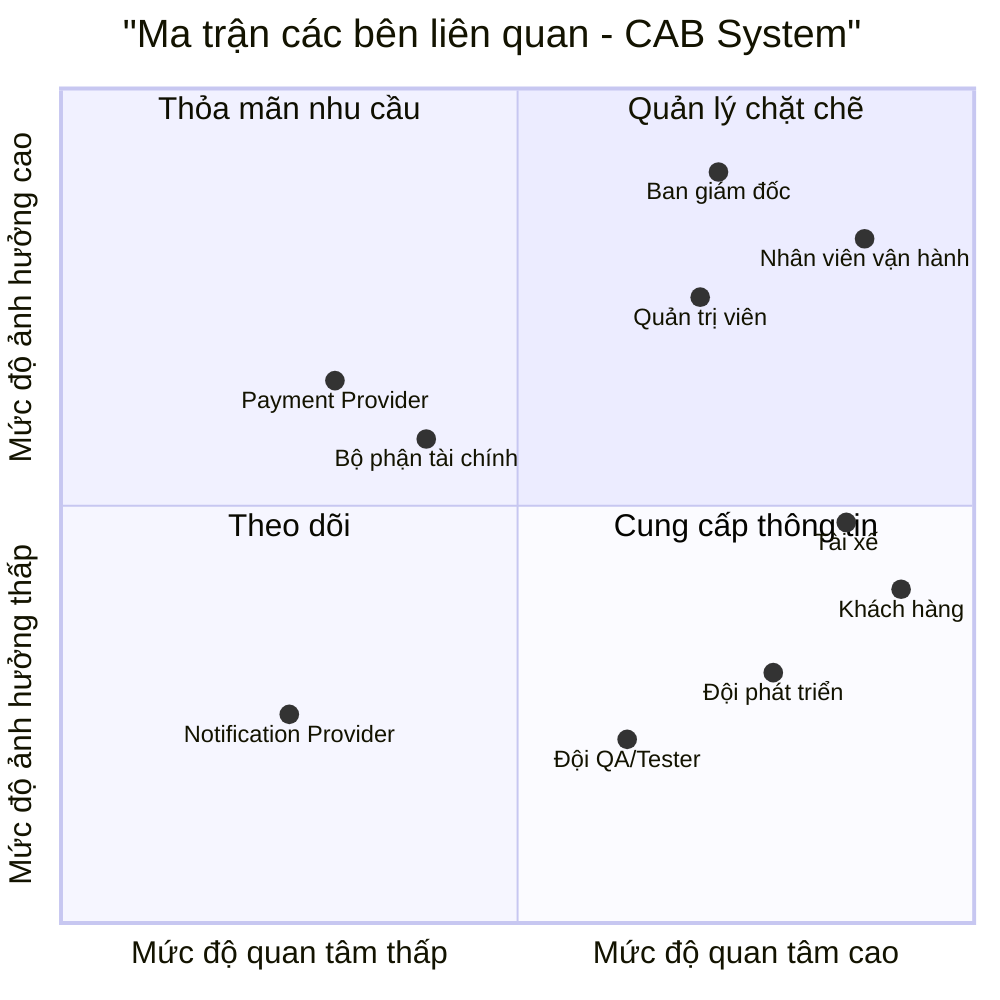
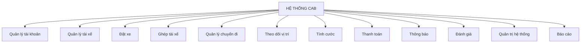
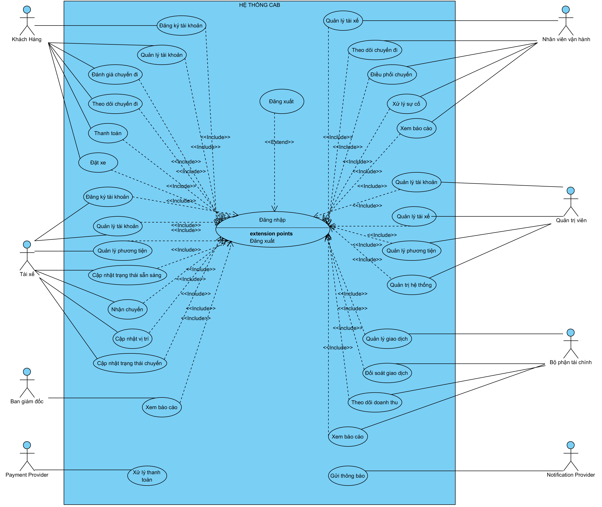

# 23645591_NGUYENHIEUTHIEN_CABSYSTEM

# BƯỚC 1: TÌM HIỂU NGHIỆP VỤ

## 1.1. Tổng quan nghiệp vụ

**CAB System** là hệ thống đặt xe trực tuyến của Công ty ABC, được xây dựng nhằm thay thế một phần quy trình điều phối thủ công bằng quy trình đặt xe và điều phối tự động.

### Luồng nghiệp vụ chính

**Đặt xe → Tìm tài xế → Nhận chuyến → Thực hiện chuyến → Tính cước → Thanh toán → Đánh giá**

## 1.2. Các nghiệp vụ chính

- **Khách hàng:** Đăng ký/đăng nhập, nhập điểm đi và điểm đến, chọn loại xe, đặt xe, theo dõi tài xế và trạng thái chuyến đi, thanh toán và đánh giá chuyến.
- **Tài xế:** Quản lý hồ sơ và phương tiện, chuyển trạng thái sẵn sàng/không sẵn sàng, nhận hoặc từ chối chuyến, cập nhật trạng thái chuyến và gửi vị trí hiện tại.
- **Bộ phận vận hành:** Theo dõi các chuyến đang diễn ra, quản lý thông tin khách hàng/tài xế/phương tiện, hỗ trợ xử lý chuyến lỗi và tra cứu lịch sử.
- **Hệ thống:** Tiếp nhận yêu cầu đặt xe, tìm và ghép tài xế, chuyển sang tài xế khác khi cần, tính cước, xử lý thanh toán, gửi thông báo và tổng hợp số liệu vận hành.

## 1.3. Vấn đề cần thay đổi

Hệ thống/quy trình hiện tại còn phụ thuộc nhiều vào thao tác thủ công, khách hàng thiếu khả năng theo dõi chuyến theo thời gian thực, dữ liệu giao dịch chưa tập trung và khó đảm bảo khả năng mở rộng khi nhu cầu tăng.

Vì vậy, cần chuyển sang một hệ thống có khả năng tự động hóa các nghiệp vụ cốt lõi, đồng thời tăng khả năng giám sát và kiểm soát dữ liệu.

## 1.4. Một số câu hỏi cần BA làm rõ

1. Khi ghép tài xế, doanh nghiệp ưu tiên tiêu chí nào: khoảng cách, thời gian chờ hay điểm đánh giá?
2. Tài xế có bao nhiêu giây để phản hồi trước khi hệ thống chuyển sang tài xế khác?
3. Công thức tính cước và chính sách hủy chuyến cụ thể như thế nào?
4. Khi thanh toán điện tử thất bại, khách hàng có được chuyển sang tiền mặt không?
5. Dữ liệu lịch sử chuyến đi và vị trí GPS cần được lưu trong bao lâu?

---

# BƯỚC 2: XÁC ĐỊNH CÁC BÊN LIÊN QUAN (STAKEHOLDERS)

## 2.1. Bảng Stakeholder và Vai trò

| STT | Stakeholder | Vai trò trong hệ thống | Kỳ vọng chính |
|---:|---|---|---|
| 1 | **Ban giám đốc** | Định hướng mục tiêu, ngân sách và hiệu quả kinh doanh | Hệ thống ổn định, có khả năng mở rộng, báo cáo chính xác |
| 2 | **Nhân viên vận hành** | Giám sát, điều phối và xử lý sự cố | Dashboard trực quan, dữ liệu cập nhật nhanh, xử lý sự cố thuận tiện |
| 3 | **Quản trị viên (Admin)** | Quản lý tài khoản, phân quyền và cấu hình | Bảo mật, phân quyền rõ ràng, có Audit Log |
| 4 | **Tài xế** | Nhận và thực hiện chuyến | Nhận chuyến phù hợp, thao tác đơn giản, cập nhật trạng thái nhanh |
| 5 | **Khách hàng** | Đặt xe, theo dõi, thanh toán và đánh giá | Đặt xe nhanh, minh bạch giá và thông tin tài xế |
| 6 | **Bộ phận tài chính** | Theo dõi doanh thu và đối soát | Dữ liệu giao dịch tập trung, chính xác |
| 7 | **Payment Provider** | Cung cấp dịch vụ thanh toán điện tử | API ổn định, giao dịch an toàn |
| 8 | **Notification Provider** | Cung cấp dịch vụ gửi thông báo | Gửi thông báo nhanh và ổn định |
| 9 | **Đội phát triển (Dev)** | Phân tích, thiết kế, xây dựng và triển khai | Yêu cầu rõ ràng, kiến trúc phù hợp, hoàn thành đúng 7 tuần |
| 10 | **Đội QA/Tester** | Kiểm thử chức năng và chất lượng hệ thống | Yêu cầu và tiêu chí nghiệm thu rõ ràng |

## 2.2. Stakeholder Matrix

### 2.2.1. Phân loại theo Quyền lực / Mức độ quan tâm

- **Quản lý chặt chẽ:** Ban giám đốc, Nhân viên vận hành, Quản trị viên.
- **Thỏa mãn nhu cầu:** Bộ phận tài chính, Payment Provider.
- **Theo dõi:** Notification Provider.
- **Cung cấp thông tin:** Khách hàng, Tài xế, Đội phát triển, Đội QA/Tester.

### 2.2.2. Ma trận các bên liên quan

## 2.3. Chiến lược quản lý Stakeholder

| Nhóm | Stakeholder | Cách quản lý |
|---|---|---|
| **Quản lý chặt chẽ** | Ban giám đốc, Nhân viên vận hành, Quản trị viên | Trao đổi thường xuyên, xác nhận yêu cầu, ưu tiên chức năng và theo dõi tiến độ |
| **Thỏa mãn nhu cầu** | Bộ phận tài chính, Payment Provider | Cập nhật theo các mốc quan trọng, thống nhất yêu cầu nghiệp vụ và yêu cầu tích hợp |
| **Theo dõi** | Notification Provider | Theo dõi khả năng đáp ứng, tình trạng tích hợp và xử lý khi có lỗi |
| **Cung cấp thông tin** | Khách hàng, Tài xế, Đội phát triển (Dev), Đội QA/Tester | Thu thập phản hồi, cung cấp thông tin cần thiết và phối hợp trong quá trình phát triển hệ thống |
# BƯỚC 3: MỤC ĐÍCH NGHIỆP VỤ (BUSINESS PURPOSE & GOALS)

## 3.1. Mục đích nghiệp vụ

CAB System được xây dựng nhằm **tự động hóa quy trình đặt xe và điều phối chuyến**, giảm sự phụ thuộc vào thao tác thủ công và nâng cao hiệu quả vận hành.

Hệ thống hướng đến việc quản lý tập trung toàn bộ quy trình:

**Đặt xe → Tìm tài xế → Nhận chuyến → Thực hiện chuyến → Tính cước → Thanh toán → Đánh giá**

Đồng thời, hệ thống cung cấp khả năng theo dõi trạng thái chuyến đi, quản lý thông tin khách hàng và tài xế, xử lý thanh toán, gửi thông báo và hỗ trợ quản lý dữ liệu vận hành.

## 3.2. Mục tiêu nghiệp vụ

| STT | Mục tiêu | Mô tả |
|---:|---|---|
| 1 | **Tự động hóa đặt xe** | Cho phép khách hàng chủ động tạo yêu cầu đặt xe thông qua hệ thống. |
| 2 | **Tự động ghép tài xế** | Tìm kiếm và ghép tài xế phù hợp với yêu cầu chuyến đi. |
| 3 | **Theo dõi chuyến đi** | Cho phép khách hàng và bộ phận vận hành theo dõi trạng thái chuyến đi. |
| 4 | **Quản lý tài xế** | Quản lý thông tin, trạng thái hoạt động và quá trình thực hiện chuyến của tài xế. |
| 5 | **Tính cước tự động** | Hỗ trợ tính toán chi phí chuyến đi dựa trên các quy tắc tính cước của hệ thống. |
| 6 | **Thanh toán điện tử** | Hỗ trợ xử lý thanh toán và ghi nhận thông tin giao dịch. |
| 7 | **Gửi thông báo** | Gửi thông báo đến khách hàng và tài xế khi có sự kiện liên quan đến chuyến đi. |
| 8 | **Đánh giá chuyến đi** | Cho phép khách hàng đánh giá chất lượng chuyến đi sau khi hoàn thành. |
| 9 | **Quản lý và báo cáo** | Hỗ trợ bộ phận vận hành và quản lý theo dõi dữ liệu, lịch sử và tình hình hoạt động của hệ thống. |

## 3.3. Giá trị mang lại

- **Đối với khách hàng:**
  - Đặt xe thuận tiện và nhanh chóng.
  - Có thể theo dõi trạng thái chuyến đi.
  - Minh bạch thông tin chuyến và chi phí.
  - Có thể thực hiện thanh toán và đánh giá chuyến đi.

- **Đối với tài xế:**
  - Nhận chuyến thông qua hệ thống.
  - Quản lý trạng thái hoạt động.
  - Cập nhật trạng thái và vị trí trong quá trình thực hiện chuyến.

- **Đối với bộ phận vận hành:**
  - Theo dõi và điều phối chuyến tập trung.
  - Hỗ trợ xử lý các chuyến có vấn đề.
  - Tra cứu lịch sử và dữ liệu vận hành.

- **Đối với doanh nghiệp:**
  - Giảm phụ thuộc vào quy trình thủ công.
  - Tập trung hóa dữ liệu.
  - Nâng cao hiệu quả quản lý và vận hành.
  - Tạo nền tảng để mở rộng hệ thống trong tương lai.
  # BƯỚC 4: PHẠM VI DỰ ÁN (PROJECT SCOPE - 7 TUẦN)

## 4.1. Phạm vi trong dự án (In-Scope)

Dự án tập trung xây dựng các chức năng cốt lõi phục vụ quy trình đặt xe và vận hành chuyến đi.

| STT | Phạm vi | Nội dung |
|---:|---|---|
| 1 | **Quản lý tài khoản** | Đăng ký, đăng nhập, quản lý thông tin người dùng và phân quyền. |
| 2 | **Đặt xe** | Khách hàng nhập điểm đi, điểm đến, lựa chọn loại xe và tạo yêu cầu đặt xe. |
| 3 | **Ghép tài xế** | Tìm kiếm và ghép tài xế phù hợp với yêu cầu chuyến đi. |
| 4 | **Quản lý chuyến đi** | Theo dõi và cập nhật trạng thái chuyến từ khi tạo đến khi hoàn thành hoặc hủy. |
| 5 | **Theo dõi vị trí** | Cập nhật và hiển thị vị trí tài xế trong quá trình thực hiện chuyến. |
| 6 | **Tính cước** | Tính toán chi phí chuyến đi theo quy tắc của hệ thống. |
| 7 | **Thanh toán** | Hỗ trợ thanh toán và ghi nhận thông tin giao dịch. |
| 8 | **Thông báo** | Gửi thông báo đến khách hàng và tài xế khi có thay đổi liên quan đến chuyến đi. |
| 9 | **Đánh giá** | Cho phép khách hàng đánh giá chuyến đi sau khi hoàn thành. |
| 10 | **Quản trị hệ thống** | Quản lý tài khoản, tài xế, phương tiện và dữ liệu vận hành. |
| 11 | **Báo cáo** | Hỗ trợ theo dõi và tổng hợp dữ liệu phục vụ quản lý và vận hành. |

## 4.2. Phạm vi ngoài dự án (Out-of-Scope)

Các chức năng sau không thuộc phạm vi triển khai trong phiên bản hiện tại:

- Các chức năng nâng cao chưa cần thiết cho phiên bản đầu tiên.
- Các hệ thống hoặc dịch vụ không trực tiếp phục vụ quy trình đặt và thực hiện chuyến.
- Các tính năng mở rộng chưa được ưu tiên trong kế hoạch 7 tuần.
- Các yêu cầu phát sinh ngoài phạm vi đã thống nhất của dự án.

## 4.3. Kế hoạch triển khai trong 7 tuần

| Tuần | Giai đoạn | Công việc chính |
|---:|---|---|
| **Tuần 1** | **Phân tích** | Tìm hiểu nghiệp vụ, xác định Stakeholder, mục tiêu, phạm vi và yêu cầu hệ thống. |
| **Tuần 2** | **Thiết kế** | Thiết kế kiến trúc, cơ sở dữ liệu, các thành phần và giao diện chính của hệ thống. |
| **Tuần 3** | **Phát triển** | Xây dựng các chức năng quản lý tài khoản và các chức năng nền tảng. |
| **Tuần 4** | **Phát triển** | Xây dựng chức năng đặt xe, ghép tài xế và quản lý chuyến đi. |
| **Tuần 5** | **Phát triển** | Xây dựng tính cước, thanh toán, thông báo và các chức năng liên quan. |
| **Tuần 6** | **Kiểm thử** | Kiểm thử chức năng, xử lý lỗi và kiểm tra tính ổn định của hệ thống. |
| **Tuần 7** | **Hoàn thiện** | Hoàn thiện hệ thống, nghiệm thu, hoàn thiện tài liệu và chuẩn bị bàn giao. |

## 4.4. Giới hạn của dự án

- Dự án được thực hiện trong thời gian **7 tuần**.
- Ưu tiên xây dựng các chức năng cốt lõi phục vụ quy trình đặt xe và vận hành.
- Các chức năng mở rộng chỉ được thực hiện khi còn thời gian và nguồn lực.
- Các yêu cầu phát sinh ngoài phạm vi phải được xem xét và đánh giá trước khi đưa vào dự án.
# BƯỚC 5: PHÂN TÍCH YÊU CẦU HỆ THỐNG (REQUIREMENTS ANALYSIS)

## 5.1. Yêu cầu nghiệp vụ (Business Requirements)

| ID | Yêu cầu nghiệp vụ | Mô tả |
|---|---|---|
| **BR-01** | Đặt xe trực tuyến | Khách hàng có thể tạo yêu cầu đặt xe thông qua hệ thống. |
| **BR-02** | Tự động ghép tài xế | Hệ thống tự động tìm và ghép tài xế phù hợp với yêu cầu chuyến đi. |
| **BR-03** | Quản lý chuyến đi | Hệ thống quản lý toàn bộ vòng đời của chuyến đi từ khi tạo đến khi hoàn thành hoặc hủy. |
| **BR-04** | Theo dõi chuyến đi | Khách hàng và bộ phận vận hành có thể theo dõi trạng thái chuyến đi. |
| **BR-05** | Tính cước | Hệ thống tự động tính chi phí chuyến đi theo quy tắc tính cước. |
| **BR-06** | Thanh toán | Hệ thống hỗ trợ xử lý và ghi nhận giao dịch thanh toán. |
| **BR-07** | Thông báo | Hệ thống gửi thông báo đến các bên liên quan khi có sự kiện trong chuyến đi. |
| **BR-08** | Đánh giá chuyến đi | Khách hàng có thể đánh giá chuyến đi sau khi hoàn thành. |
| **BR-09** | Quản lý vận hành | Bộ phận vận hành có thể theo dõi, quản lý và xử lý các vấn đề phát sinh trong quá trình vận hành. |
| **BR-10** | Báo cáo | Hệ thống cung cấp dữ liệu phục vụ việc theo dõi và đánh giá hoạt động kinh doanh. |

## 5.2. Yêu cầu chức năng (Functional Requirements)

| ID | Chức năng | Mô tả |
|---|---|---|
| **FR-AUTH** | Quản lý xác thực | Đăng ký, đăng nhập, đăng xuất và xác thực người dùng. |
| **FR-USER** | Quản lý người dùng | Quản lý thông tin khách hàng, tài xế và các tài khoản liên quan. |
| **FR-DRIVER** | Quản lý tài xế | Quản lý hồ sơ, trạng thái hoạt động và thông tin phương tiện của tài xế. |
| **FR-BOOKING** | Đặt xe | Cho phép khách hàng nhập thông tin chuyến đi và tạo yêu cầu đặt xe. |
| **FR-MATCHING** | Ghép tài xế | Tìm kiếm và ghép tài xế phù hợp với yêu cầu đặt xe. |
| **FR-TRIP** | Quản lý chuyến | Tạo, cập nhật, theo dõi và hoàn tất hoặc hủy chuyến. |
| **FR-GPS** | Theo dõi vị trí | Nhận và cập nhật vị trí của tài xế trong quá trình thực hiện chuyến. |
| **FR-FARE** | Tính cước | Tính toán chi phí chuyến đi dựa trên các quy tắc tính cước. |
| **FR-PAYMENT** | Thanh toán | Xử lý thanh toán và ghi nhận trạng thái giao dịch. |
| **FR-NOTIFICATION** | Thông báo | Gửi thông báo đến khách hàng, tài xế và các bên liên quan. |
| **FR-RATING** | Đánh giá | Cho phép khách hàng đánh giá chuyến đi. |
| **FR-REPORT** | Báo cáo | Cung cấp thông tin và dữ liệu phục vụ quản lý, vận hành. |
| **FR-ADMIN** | Quản trị hệ thống | Quản lý tài khoản, phân quyền và các dữ liệu quản trị. |

## 5.3. Quy tắc nghiệp vụ (Business Rules)

| ID | Quy tắc nghiệp vụ | Mô tả |
|---|---|---|
| **BRULE-01** | Điều kiện đặt xe | Khách hàng phải cung cấp đầy đủ thông tin cần thiết trước khi tạo yêu cầu đặt xe. |
| **BRULE-02** | Ghép tài xế | Hệ thống ưu tiên tài xế phù hợp dựa trên các tiêu chí được doanh nghiệp quy định. |
| **BRULE-03** | Nhận chuyến | Tài xế phải xác nhận nhận chuyến trong khoảng thời gian quy định. |
| **BRULE-04** | Chuyển tài xế | Nếu tài xế từ chối hoặc không phản hồi, hệ thống có thể chuyển yêu cầu sang tài xế khác. |
| **BRULE-05** | Trạng thái chuyến | Chuyến đi phải tuân theo trình tự trạng thái được hệ thống quy định. |
| **BRULE-06** | Tính cước | Chi phí chuyến đi được xác định theo quy tắc tính cước của hệ thống. |
| **BRULE-07** | Thanh toán | Giao dịch phải được ghi nhận với trạng thái tương ứng sau khi hệ thống xử lý thanh toán. |
| **BRULE-08** | Đánh giá | Khách hàng chỉ có thể đánh giá sau khi chuyến đi hoàn thành. |

## 5.4. Ngoại lệ và xử lý ngoại lệ (Exception Handling)

| ID | Tình huống | Cách xử lý |
|---|---|---|
| **EX-01** | Không tìm thấy tài xế | Hệ thống thông báo cho khách hàng và xử lý theo chính sách của doanh nghiệp. |
| **EX-02** | Tài xế từ chối chuyến | Hệ thống tìm và gửi yêu cầu đến tài xế khác. |
| **EX-03** | Tài xế không phản hồi | Sau thời gian quy định, hệ thống chuyển yêu cầu sang tài xế khác. |
| **EX-04** | Thanh toán thất bại | Hệ thống ghi nhận giao dịch thất bại và thông báo cho khách hàng. |
| **EX-05** | Mất kết nối GPS | Hệ thống xử lý trạng thái vị trí và thông báo khi cần thiết. |
| **EX-06** | Hủy chuyến | Hệ thống kiểm tra điều kiện hủy và áp dụng chính sách tương ứng. |

## 5.5. Ưu tiên yêu cầu (MoSCoW)

| Mức độ | Ý nghĩa | Nhóm chức năng |
|---|---|---|
| **Must Have** | Bắt buộc phải có | Đăng nhập, đặt xe, ghép tài xế, quản lý chuyến, tính cước |
| **Should Have** | Nên có | Theo dõi vị trí, thông báo, thanh toán điện tử |
| **Could Have** | Có thể có | Các chức năng nâng cao và cải thiện trải nghiệm |
| **Won't Have** | Chưa thực hiện trong phiên bản hiện tại | Các chức năng mở rộng ngoài phạm vi 7 tuần |

## 5.6. Rủi ro liên quan đến yêu cầu

| ID | Rủi ro | Mức độ ảnh hưởng | Hướng xử lý |
|---|---|---|---|
| **R-01** | Yêu cầu nghiệp vụ chưa rõ ràng | Cao | Làm rõ và xác nhận yêu cầu với Stakeholder. |
| **R-02** | Thay đổi yêu cầu trong quá trình phát triển | Cao | Kiểm soát phạm vi và đánh giá tác động trước khi thay đổi. |
| **R-03** | Phụ thuộc Payment Provider | Trung bình | Xác định rõ yêu cầu tích hợp và phương án xử lý khi dịch vụ lỗi. |
| **R-04** | Phụ thuộc Notification Provider | Trung bình | Có cơ chế xử lý khi dịch vụ thông báo không khả dụng. |
| **R-05** | Dữ liệu GPS không ổn định | Trung bình | Kiểm tra trạng thái kết nối và xử lý khi mất dữ liệu vị trí. |
| **R-06** | Thời gian thực hiện dự án chỉ 7 tuần | Cao | Ưu tiên các chức năng quan trọng và kiểm soát phạm vi dự án. |
# BƯỚC 6: PHÂN RÃ CHỨC NĂNG HỆ THỐNG (FUNCTIONAL DECOMPOSITION)

## 6.1. Bảng phân rã chức năng hệ thống

| STT | Nhóm chức năng | Chức năng |
|---:|---|---|
| 1 | **Quản lý tài khoản** | Đăng ký, đăng nhập, đăng xuất, quản lý thông tin tài khoản và phân quyền |
| 2 | **Quản lý tài xế** | Quản lý hồ sơ tài xế, phương tiện và trạng thái hoạt động |
| 3 | **Đặt xe** | Nhập thông tin chuyến đi, lựa chọn loại xe và tạo yêu cầu đặt xe |
| 4 | **Ghép tài xế** | Tìm kiếm, lựa chọn và ghép tài xế phù hợp với yêu cầu đặt xe |
| 5 | **Quản lý chuyến đi** | Tạo, cập nhật, theo dõi, hoàn thành và hủy chuyến |
| 6 | **Theo dõi vị trí** | Cập nhật và theo dõi vị trí của tài xế trong quá trình thực hiện chuyến |
| 7 | **Tính cước** | Tính toán chi phí chuyến đi theo quy tắc tính cước |
| 8 | **Thanh toán** | Xử lý và ghi nhận giao dịch thanh toán |
| 9 | **Thông báo** | Gửi thông báo về trạng thái chuyến, tài xế và thanh toán |
| 10 | **Đánh giá** | Cho phép khách hàng đánh giá chuyến đi |
| 11 | **Quản trị hệ thống** | Quản lý tài khoản, phân quyền và dữ liệu quản trị |
| 12 | **Báo cáo** | Tổng hợp và cung cấp dữ liệu phục vụ quản lý và vận hành |

## 6.2. Sơ đồ phân rã chức năng

## 6.3. Mối liên hệ giữa yêu cầu và chức năng

| Yêu cầu | Chức năng tương ứng |
|---|---|
| **BR-01: Đặt xe trực tuyến** | Đặt xe |
| **BR-02: Tự động ghép tài xế** | Ghép tài xế |
| **BR-03: Quản lý chuyến đi** | Quản lý chuyến đi |
| **BR-04: Theo dõi chuyến đi** | Theo dõi vị trí, Quản lý chuyến đi |
| **BR-05: Tính cước** | Tính cước |
| **BR-06: Thanh toán** | Thanh toán |
| **BR-07: Thông báo** | Thông báo |
| **BR-08: Đánh giá chuyến đi** | Đánh giá |
| **BR-09: Quản lý vận hành** | Quản trị hệ thống, Quản lý chuyến đi |
| **BR-10: Báo cáo** | Báo cáo |
# BƯỚC 7: VẼ USE CASE TỔNG QUÁT

## Sơ đồ Use Case tổng quát của hệ thống CAB

# BƯỚC 8: ĐẶC TẢ USE CASE

## UC-01. Đăng nhập

| Thuộc tính | Nội dung |
|---|---|
| **Mã Use Case** | UC-01 |
| **Tên Use Case** | Đăng nhập |
| **Mục tiêu** | Cho phép người dùng có tài khoản truy cập vào hệ thống CAB và sử dụng các chức năng phù hợp với vai trò được phân quyền. |
| **Actor chính** | Khách hàng, Tài xế, Nhân viên vận hành, Quản trị viên, Bộ phận tài chính, Ban giám đốc |
| **Actor phụ** | Không |
| **Mô tả** | Người dùng cung cấp thông tin xác thực. Hệ thống kiểm tra thông tin, xác định vai trò và cấp quyền truy cập tương ứng. |
| **Pre-condition** | Người dùng đã có tài khoản hợp lệ và tài khoản đang hoạt động. |
| **Post-condition** | Người dùng đăng nhập thành công và được chuyển đến giao diện phù hợp với vai trò. |
| **Trigger** | Người dùng chọn chức năng Đăng nhập. |

### Luồng sự kiện chính

| Bước | Actor | Hệ thống |
|---:|---|---|
| 1 | Người dùng chọn **Đăng nhập**. | Hiển thị màn hình đăng nhập. |
| 2 | Người dùng nhập tên đăng nhập/số điện thoại và mật khẩu. | Tiếp nhận thông tin. |
| 3 | Người dùng nhấn **Đăng nhập**. | Kiểm tra dữ liệu bắt buộc. |
| 4 | | Kiểm tra tài khoản có tồn tại hay không. |
| 5 | | Kiểm tra mật khẩu. |
| 6 | | Kiểm tra trạng thái tài khoản. |
| 7 | | Xác định vai trò của tài khoản. |
| 8 | | Tạo phiên đăng nhập. |
| 9 | | Cấp quyền truy cập theo vai trò. |
| 10 | | Hiển thị giao diện chính tương ứng với vai trò. |

### Luồng thay thế

**A1. Người dùng đã có phiên đăng nhập hợp lệ**

1. Người dùng truy cập hệ thống.
2. Hệ thống kiểm tra phiên đăng nhập.
3. Nếu phiên còn hiệu lực, hệ thống bỏ qua bước xác thực lại.
4. Hệ thống chuyển người dùng đến giao diện chính.

### Luồng ngoại lệ

**E1. Tài khoản hoặc mật khẩu không chính xác**

1. Hệ thống xác thực không thành công.
2. Hệ thống thông báo thông tin đăng nhập không chính xác.
3. Người dùng nhập lại thông tin.

**E2. Tài khoản bị khóa**

1. Hệ thống phát hiện tài khoản đang bị khóa.
2. Hệ thống từ chối đăng nhập.
3. Hệ thống thông báo trạng thái tài khoản.

**E3. Tài khoản chưa được kích hoạt**

1. Hệ thống phát hiện tài khoản chưa được kích hoạt.
2. Hệ thống từ chối truy cập.
3. Hệ thống yêu cầu người dùng hoàn tất kích hoạt tài khoản.

### Quy tắc nghiệp vụ

- Chỉ tài khoản hợp lệ và đang hoạt động mới được đăng nhập.
- Mỗi người dùng chỉ được truy cập các chức năng thuộc quyền của mình.
- Hệ thống sử dụng một Use Case Đăng nhập chung cho các actor có tài khoản.
- Thông tin xác thực phải được kiểm tra trước khi cấp quyền truy cập.

---

## UC-02. Đăng ký tài khoản

| Thuộc tính | Nội dung |
|---|---|
| **Mã Use Case** | UC-02 |
| **Tên Use Case** | Đăng ký tài khoản |
| **Mục tiêu** | Cho phép người dùng mới tạo tài khoản để sử dụng hệ thống CAB. |
| **Actor chính** | Khách hàng, Tài xế |
| **Actor phụ** | Không |
| **Mô tả** | Người dùng cung cấp thông tin đăng ký. Hệ thống kiểm tra tính hợp lệ và tạo tài khoản mới. |
| **Pre-condition** | Người dùng chưa có tài khoản hợp lệ trên hệ thống. |
| **Post-condition** | Tài khoản được tạo thành công và có trạng thái phù hợp để sử dụng. |
| **Trigger** | Người dùng chọn chức năng Đăng ký tài khoản. |

### Luồng sự kiện chính

| Bước | Actor | Hệ thống |
|---:|---|---|
| 1 | Người dùng chọn **Đăng ký tài khoản**. | Hiển thị biểu mẫu đăng ký. |
| 2 | Người dùng nhập thông tin cá nhân. | Tiếp nhận thông tin. |
| 3 | Người dùng nhập số điện thoại/tên đăng nhập và mật khẩu. | Kiểm tra dữ liệu nhập. |
| 4 | Người dùng xác nhận đăng ký. | Kiểm tra các trường bắt buộc. |
| 5 | | Kiểm tra thông tin tài khoản đã tồn tại hay chưa. |
| 6 | | Kiểm tra tính hợp lệ của dữ liệu. |
| 7 | | Tạo tài khoản mới. |
| 8 | | Gán vai trò tương ứng cho tài khoản. |
| 9 | | Lưu thông tin tài khoản. |
| 10 | | Thông báo đăng ký thành công. |

### Luồng thay thế

**A1. Người dùng muốn hủy đăng ký**

1. Người dùng chọn Hủy.
2. Hệ thống dừng quá trình đăng ký.
3. Hệ thống quay về màn hình trước đó.

### Luồng ngoại lệ

**E1. Số điện thoại/tên đăng nhập đã tồn tại**

1. Hệ thống phát hiện thông tin đã được sử dụng.
2. Hệ thống thông báo cho người dùng.
3. Người dùng nhập thông tin khác.

**E2. Dữ liệu đăng ký không hợp lệ**

1. Hệ thống phát hiện dữ liệu không đúng định dạng.
2. Hệ thống đánh dấu trường dữ liệu lỗi.
3. Người dùng chỉnh sửa thông tin.

### Quy tắc nghiệp vụ

- Mỗi tài khoản phải có thông tin định danh duy nhất.
- Không được tạo nhiều tài khoản sử dụng cùng thông tin định danh.
- Tài khoản phải được gán đúng vai trò.
- Thông tin bắt buộc phải được nhập đầy đủ.

---

## UC-03. Quản lý tài khoản

| Thuộc tính | Nội dung |
|---|---|
| **Mã Use Case** | UC-03 |
| **Tên Use Case** | Quản lý tài khoản |
| **Mục tiêu** | Cho phép người dùng và người có quyền quản trị quản lý thông tin tài khoản. |
| **Actor chính** | Khách hàng, Tài xế, Quản trị viên |
| **Actor phụ** | Không |
| **Mô tả** | Người dùng xem, cập nhật thông tin tài khoản; quản trị viên có thể quản lý tài khoản theo quyền được cấp. |
| **Pre-condition** | Người dùng đã đăng nhập và có quyền truy cập chức năng. |
| **Post-condition** | Thông tin tài khoản được cập nhật hoặc trạng thái tài khoản được thay đổi thành công. |
| **Trigger** | Actor chọn chức năng Quản lý tài khoản. |

### Luồng sự kiện chính

| Bước | Actor | Hệ thống |
|---:|---|---|
| 1 | Actor chọn **Quản lý tài khoản**. | Hiển thị thông tin tài khoản. |
| 2 | Actor xem thông tin. | Truy xuất dữ liệu tài khoản. |
| 3 | Actor chọn chỉnh sửa thông tin. | Hiển thị biểu mẫu cập nhật. |
| 4 | Actor nhập thông tin mới. | Kiểm tra dữ liệu. |
| 5 | Actor xác nhận cập nhật. | Kiểm tra tính hợp lệ. |
| 6 | | Lưu thông tin mới. |
| 7 | | Thông báo cập nhật thành công. |

### Luồng thay thế

**A1. Actor chỉ xem thông tin**

1. Actor mở chức năng quản lý tài khoản.
2. Hệ thống hiển thị thông tin.
3. Actor kết thúc thao tác.

### Luồng ngoại lệ

**E1. Thông tin không hợp lệ**

1. Hệ thống phát hiện dữ liệu không hợp lệ.
2. Hệ thống thông báo lỗi.
3. Actor chỉnh sửa dữ liệu.

**E2. Không có quyền cập nhật**

1. Hệ thống kiểm tra quyền.
2. Hệ thống phát hiện Actor không có quyền.
3. Hệ thống từ chối thao tác.

### Quy tắc nghiệp vụ

- Người dùng chỉ được quản lý tài khoản của mình.
- Quản trị viên được quản lý tài khoản theo quyền được cấp.
- Thông tin cập nhật phải hợp lệ.
- Mọi thay đổi quan trọng phải được lưu vào hệ thống.

---

## UC-04. Đánh giá chuyến đi

| Thuộc tính | Nội dung |
|---|---|
| **Mã Use Case** | UC-04 |
| **Tên Use Case** | Đánh giá chuyến đi |
| **Mục tiêu** | Cho phép khách hàng đánh giá chất lượng chuyến đi sau khi hoàn thành. |
| **Actor chính** | Khách hàng |
| **Actor phụ** | Không |
| **Mô tả** | Khách hàng đánh giá chuyến đi bằng điểm số và/hoặc nhận xét. |
| **Pre-condition** | Khách hàng đã thực hiện và hoàn thành chuyến đi. |
| **Post-condition** | Đánh giá được lưu vào hệ thống và gắn với chuyến đi tương ứng. |
| **Trigger** | Khách hàng chọn đánh giá chuyến đi. |

### Luồng sự kiện chính

| Bước | Actor | Hệ thống |
|---:|---|---|
| 1 | Khách hàng chọn chuyến đã hoàn thành. | Kiểm tra trạng thái chuyến. |
| 2 | Khách hàng chọn mức đánh giá. | Hiển thị biểu mẫu đánh giá. |
| 3 | Khách hàng nhập nhận xét nếu có. | Tiếp nhận nội dung. |
| 4 | Khách hàng nhấn **Gửi đánh giá**. | Kiểm tra dữ liệu. |
| 5 | | Lưu đánh giá. |
| 6 | | Liên kết đánh giá với chuyến đi và tài xế. |
| 7 | | Thông báo đánh giá thành công. |

### Luồng thay thế

**A1. Khách hàng không nhập nhận xét**

1. Khách hàng chỉ chọn mức điểm.
2. Hệ thống vẫn cho phép gửi đánh giá.
3. Hệ thống lưu đánh giá.

### Luồng ngoại lệ

**E1. Chuyến đi chưa hoàn thành**

1. Hệ thống kiểm tra trạng thái chuyến.
2. Phát hiện chuyến chưa hoàn thành.
3. Hệ thống không cho phép đánh giá.

### Quy tắc nghiệp vụ

- Chỉ chuyến đã hoàn thành mới được đánh giá.
- Mỗi chuyến chỉ được đánh giá theo quy định của hệ thống.
- Điểm đánh giá phải nằm trong khoảng điểm được hệ thống quy định.

---

## UC-05. Theo dõi chuyến đi

| Thuộc tính | Nội dung |
|---|---|
| **Mã Use Case** | UC-05 |
| **Tên Use Case** | Theo dõi chuyến đi |
| **Mục tiêu** | Cho phép khách hàng theo dõi trạng thái và vị trí chuyến đi. |
| **Actor chính** | Khách hàng |
| **Actor phụ** | Nhân viên vận hành |
| **Mô tả** | Hệ thống cung cấp thông tin về trạng thái, vị trí và tiến trình chuyến đi. |
| **Pre-condition** | Khách hàng có chuyến đi đang được thực hiện hoặc có quyền xem chuyến. |
| **Post-condition** | Thông tin chuyến đi được hiển thị cập nhật. |
| **Trigger** | Actor chọn Theo dõi chuyến đi. |

### Luồng sự kiện chính

| Bước | Actor | Hệ thống |
|---:|---|---|
| 1 | Actor chọn chuyến cần theo dõi. | Truy xuất thông tin chuyến. |
| 2 | | Hiển thị trạng thái chuyến. |
| 3 | | Hiển thị thông tin tài xế. |
| 4 | | Hiển thị vị trí hiện tại của xe nếu có dữ liệu. |
| 5 | | Cập nhật thông tin chuyến theo dữ liệu mới. |
| 6 | Actor theo dõi tiến trình chuyến. | Hiển thị trạng thái mới nhất. |

### Luồng thay thế

**A1. Chưa có dữ liệu vị trí**

1. Hệ thống không nhận được dữ liệu vị trí mới.
2. Hệ thống hiển thị vị trí gần nhất hoặc thông báo chưa có dữ liệu.

### Luồng ngoại lệ

**E1. Không tìm thấy chuyến**

1. Hệ thống kiểm tra mã chuyến.
2. Không tìm thấy chuyến phù hợp.
3. Hệ thống thông báo lỗi.

### Quy tắc nghiệp vụ

- Chỉ người có quyền mới được xem thông tin chuyến.
- Vị trí phải được cập nhật theo dữ liệu thực tế.
- Thông tin hiển thị phải phản ánh trạng thái mới nhất của chuyến.

---

## UC-06. Thanh toán

| Thuộc tính | Nội dung |
|---|---|
| **Mã Use Case** | UC-06 |
| **Tên Use Case** | Thanh toán |
| **Mục tiêu** | Cho phép khách hàng thanh toán chi phí chuyến đi. |
| **Actor chính** | Khách hàng |
| **Actor phụ** | Payment Provider |
| **Mô tả** | Hệ thống thực hiện thanh toán theo phương thức được khách hàng lựa chọn. |
| **Pre-condition** | Chuyến đi đã phát sinh cước phí và có số tiền cần thanh toán. |
| **Post-condition** | Thanh toán thành công hoặc trạng thái thanh toán được ghi nhận. |
| **Trigger** | Khách hàng chọn Thanh toán. |

### Luồng sự kiện chính

| Bước | Actor | Hệ thống |
|---:|---|---|
| 1 | Khách hàng chọn **Thanh toán**. | Hiển thị số tiền và phương thức thanh toán. |
| 2 | Khách hàng chọn phương thức thanh toán. | Kiểm tra phương thức được hỗ trợ. |
| 3 | Khách hàng xác nhận thanh toán. | Tạo yêu cầu thanh toán. |
| 4 | | Gửi yêu cầu đến Payment Provider nếu cần. |
| 5 | Payment Provider xử lý giao dịch. | Tiếp nhận kết quả thanh toán. |
| 6 | | Cập nhật trạng thái thanh toán. |
| 7 | | Thông báo kết quả cho khách hàng. |

### Luồng thay thế

**A1. Thanh toán tiền mặt**

1. Khách hàng chọn tiền mặt.
2. Hệ thống ghi nhận phương thức thanh toán.
3. Trạng thái được cập nhật theo xác nhận thanh toán.

### Luồng ngoại lệ

**E1. Thanh toán thất bại**

1. Payment Provider trả về kết quả thất bại.
2. Hệ thống ghi nhận giao dịch thất bại.
3. Hệ thống thông báo cho khách hàng.
4. Khách hàng có thể thực hiện lại thanh toán.

### Quy tắc nghiệp vụ

- Số tiền thanh toán phải bằng số tiền phải thu.
- Mỗi giao dịch phải có trạng thái rõ ràng.
- Không được ghi nhận một giao dịch thành công nếu chưa nhận được xác nhận hợp lệ.

---

## UC-07. Đặt xe

| Thuộc tính | Nội dung |
|---|---|
| **Mã Use Case** | UC-07 |
| **Tên Use Case** | Đặt xe |
| **Mục tiêu** | Cho phép khách hàng tạo yêu cầu đặt xe. |
| **Actor chính** | Khách hàng |
| **Actor phụ** | Nhân viên vận hành |
| **Mô tả** | Khách hàng nhập thông tin chuyến đi và gửi yêu cầu đặt xe. |
| **Pre-condition** | Khách hàng đã đăng nhập và hệ thống đang hoạt động. |
| **Post-condition** | Yêu cầu đặt xe được tạo và chuyển sang quá trình điều phối/tìm tài xế. |
| **Trigger** | Khách hàng chọn Đặt xe. |

### Luồng sự kiện chính

| Bước | Actor | Hệ thống |
|---:|---|---|
| 1 | Khách hàng chọn **Đặt xe**. | Hiển thị biểu mẫu đặt xe. |
| 2 | Khách hàng nhập điểm đón. | Kiểm tra thông tin. |
| 3 | Khách hàng nhập điểm đến. | Kiểm tra thông tin. |
| 4 | Khách hàng xác nhận yêu cầu. | Kiểm tra dữ liệu đặt xe. |
| 5 | | Tính toán thông tin cước dự kiến nếu có. |
| 6 | | Tạo yêu cầu chuyến đi. |
| 7 | | Chuyển yêu cầu sang quá trình điều phối. |
| 8 | | Thông báo trạng thái yêu cầu cho khách hàng. |

### Luồng thay thế

**A1. Khách hàng hủy trước khi xác nhận**

1. Khách hàng chọn Hủy.
2. Hệ thống không tạo yêu cầu.
3. Quay về màn hình trước đó.

### Luồng ngoại lệ

**E1. Thiếu thông tin điểm đón/điểm đến**

1. Hệ thống kiểm tra dữ liệu.
2. Phát hiện thông tin chưa đầy đủ.
3. Hệ thống yêu cầu nhập lại.

**E2. Không có khả năng phục vụ**

1. Hệ thống kiểm tra khả năng điều phối.
2. Không tìm được phương án phục vụ.
3. Hệ thống thông báo cho khách hàng.

### Quy tắc nghiệp vụ

- Điểm đón và điểm đến phải hợp lệ.
- Một yêu cầu đặt xe phải có mã định danh duy nhất.
- Chuyến chỉ được thực hiện sau khi yêu cầu được tiếp nhận và điều phối.

---

## UC-08. Đăng xuất

| Thuộc tính | Nội dung |
|---|---|
| **Mã Use Case** | UC-08 |
| **Tên Use Case** | Đăng xuất |
| **Mục tiêu** | Cho phép người dùng kết thúc phiên làm việc trên hệ thống. |
| **Actor chính** | Khách hàng, Tài xế, Nhân viên vận hành, Quản trị viên, Bộ phận tài chính, Ban giám đốc |
| **Actor phụ** | Không |
| **Mô tả** | Người dùng yêu cầu đăng xuất và hệ thống kết thúc phiên đăng nhập hiện tại. |
| **Pre-condition** | Người dùng đang đăng nhập. |
| **Post-condition** | Phiên đăng nhập bị kết thúc và người dùng không còn quyền truy cập các chức năng yêu cầu xác thực. |
| **Trigger** | Người dùng chọn Đăng xuất. |

### Luồng sự kiện chính

| Bước | Actor | Hệ thống |
|---:|---|---|
| 1 | Người dùng chọn **Đăng xuất**. | Tiếp nhận yêu cầu. |
| 2 | | Xác định phiên đăng nhập hiện tại. |
| 3 | | Hủy/đóng phiên đăng nhập. |
| 4 | | Xóa thông tin xác thực phiên. |
| 5 | | Chuyển về màn hình đăng nhập. |

### Luồng ngoại lệ

**E1. Phiên đăng nhập đã hết hạn**

1. Hệ thống phát hiện phiên không còn hiệu lực.
2. Hệ thống xóa thông tin phiên.
3. Hệ thống chuyển về màn hình đăng nhập.

### Quy tắc nghiệp vụ

- Sau khi đăng xuất, người dùng phải đăng nhập lại để truy cập chức năng yêu cầu xác thực.
- Phiên đăng nhập phải được vô hiệu hóa sau khi đăng xuất.

---

## UC-09. Quản lý tài xế

| Thuộc tính | Nội dung |
|---|---|
| **Mã Use Case** | UC-09 |
| **Tên Use Case** | Quản lý tài xế |
| **Mục tiêu** | Cho phép quản lý thông tin và trạng thái tài xế trong hệ thống. |
| **Actor chính** | Nhân viên vận hành, Quản trị viên |
| **Actor phụ** | Không |
| **Mô tả** | Actor xem, thêm, cập nhật và quản lý thông tin tài xế theo quyền được cấp. |
| **Pre-condition** | Actor đã đăng nhập và có quyền quản lý tài xế. |
| **Post-condition** | Thông tin tài xế được cập nhật chính xác. |
| **Trigger** | Actor chọn Quản lý tài xế. |

### Luồng sự kiện chính

| Bước | Actor | Hệ thống |
|---:|---|---|
| 1 | Actor chọn **Quản lý tài xế**. | Hiển thị danh sách tài xế. |
| 2 | Actor tìm kiếm/chọn tài xế. | Hiển thị thông tin chi tiết. |
| 3 | Actor chọn thêm hoặc cập nhật thông tin. | Hiển thị biểu mẫu. |
| 4 | Actor nhập thông tin. | Kiểm tra dữ liệu. |
| 5 | Actor xác nhận. | Lưu thông tin. |
| 6 | | Cập nhật trạng thái tài xế. |
| 7 | | Thông báo kết quả. |

### Luồng ngoại lệ

**E1. Thông tin tài xế không hợp lệ**

1. Hệ thống phát hiện dữ liệu không hợp lệ.
2. Hệ thống thông báo lỗi.
3. Actor chỉnh sửa thông tin.

**E2. Tài xế không tồn tại**

1. Hệ thống không tìm thấy tài xế.
2. Hệ thống thông báo không tìm thấy dữ liệu.

### Quy tắc nghiệp vụ

- Chỉ actor có quyền mới được quản lý tài xế.
- Thông tin tài xế phải đầy đủ và hợp lệ.
- Trạng thái tài xế phải được cập nhật theo tình trạng thực tế.

---

## UC-10. Theo dõi chuyến đi - Nhân viên vận hành

| Thuộc tính | Nội dung |
|---|---|
| **Mã Use Case** | UC-10 |
| **Tên Use Case** | Theo dõi chuyến đi |
| **Mục tiêu** | Cho phép nhân viên vận hành theo dõi tình trạng các chuyến đang hoạt động. |
| **Actor chính** | Nhân viên vận hành |
| **Actor phụ** | Không |
| **Mô tả** | Nhân viên vận hành giám sát trạng thái và tiến trình chuyến để kịp thời xử lý. |
| **Pre-condition** | Nhân viên vận hành đã đăng nhập. |
| **Post-condition** | Nhân viên nắm được trạng thái hiện tại của chuyến. |
| **Trigger** | Nhân viên vận hành chọn Theo dõi chuyến đi. |

### Luồng sự kiện chính

| Bước | Actor | Hệ thống |
|---:|---|---|
| 1 | Nhân viên chọn chức năng. | Hiển thị danh sách chuyến. |
| 2 | Nhân viên chọn chuyến. | Hiển thị thông tin chi tiết. |
| 3 | | Hiển thị trạng thái chuyến. |
| 4 | | Hiển thị tài xế và phương tiện liên quan. |
| 5 | | Cập nhật thông tin mới nhất. |
| 6 | Nhân viên theo dõi tình trạng. | Ghi nhận thao tác theo dõi. |

### Luồng ngoại lệ

**E1. Mất dữ liệu cập nhật**

1. Hệ thống không nhận được dữ liệu mới.
2. Hệ thống hiển thị dữ liệu gần nhất.
3. Hệ thống cảnh báo nếu cần.

### Quy tắc nghiệp vụ

- Nhân viên vận hành chỉ xem được các chuyến thuộc phạm vi quản lý.
- Thông tin chuyến phải được cập nhật liên tục khi có dữ liệu mới.

---

## UC-11. Điều phối chuyến

| Thuộc tính | Nội dung |
|---|---|
| **Mã Use Case** | UC-11 |
| **Tên Use Case** | Điều phối chuyến |
| **Mục tiêu** | Phân công tài xế phù hợp cho yêu cầu đặt xe. |
| **Actor chính** | Nhân viên vận hành |
| **Actor phụ** | Không |
| **Mô tả** | Nhân viên vận hành tiếp nhận yêu cầu và điều phối tài xế phù hợp để thực hiện chuyến. |
| **Pre-condition** | Có yêu cầu đặt xe đang chờ xử lý. |
| **Post-condition** | Chuyến được phân công tài xế hoặc chuyển sang trạng thái cần xử lý. |
| **Trigger** | Hệ thống có yêu cầu đặt xe mới hoặc nhân viên chọn Điều phối chuyến. |

### Luồng sự kiện chính

| Bước | Actor | Hệ thống |
|---:|---|---|
| 1 | Nhân viên vận hành mở danh sách yêu cầu. | Hiển thị yêu cầu đang chờ. |
| 2 | Nhân viên chọn yêu cầu. | Hiển thị thông tin chuyến. |
| 3 | | Tìm kiếm tài xế phù hợp. |
| 4 | Nhân viên lựa chọn tài xế. | Kiểm tra trạng thái tài xế. |
| 5 | Nhân viên xác nhận điều phối. | Gán tài xế cho chuyến. |
| 6 | | Cập nhật trạng thái chuyến. |
| 7 | | Gửi thông tin chuyến cho tài xế. |
| 8 | | Thông báo cho khách hàng nếu cần. |

### Luồng thay thế

**A1. Hệ thống tự đề xuất tài xế**

1. Hệ thống tìm tài xế phù hợp.
2. Hệ thống đề xuất danh sách.
3. Nhân viên chọn tài xế.
4. Hệ thống hoàn tất điều phối.

### Luồng ngoại lệ

**E1. Không có tài xế phù hợp**

1. Hệ thống không tìm được tài xế.
2. Yêu cầu tiếp tục ở trạng thái chờ.
3. Nhân viên có thể xử lý lại sau.

**E2. Tài xế từ chối chuyến**

1. Hệ thống nhận thông tin từ chối.
2. Chuyến quay về trạng thái cần điều phối.
3. Hệ thống tìm/đề xuất tài xế khác.

### Quy tắc nghiệp vụ

- Chỉ tài xế đủ điều kiện và phù hợp trạng thái mới được điều phối.
- Một chuyến tại một thời điểm chỉ được gán cho tài xế phù hợp.
- Không điều phối tài xế đang bận hoặc không sẵn sàng.

---

## UC-12. Xử lý sự cố

| Thuộc tính | Nội dung |
|---|---|
| **Mã Use Case** | UC-12 |
| **Tên Use Case** | Xử lý sự cố |
| **Mục tiêu** | Cho phép nhân viên vận hành tiếp nhận và xử lý các sự cố phát sinh trong quá trình vận hành chuyến. |
| **Actor chính** | Nhân viên vận hành |
| **Actor phụ** | Không |
| **Mô tả** | Nhân viên tiếp nhận thông tin sự cố, xác định nguyên nhân và thực hiện phương án xử lý. |
| **Pre-condition** | Có sự cố được phát hiện hoặc báo về hệ thống. |
| **Post-condition** | Sự cố được xử lý hoặc ghi nhận trạng thái cần tiếp tục xử lý. |
| **Trigger** | Nhân viên vận hành nhận được thông báo sự cố. |

### Luồng sự kiện chính

| Bước | Actor | Hệ thống |
|---:|---|---|
| 1 | Nhân viên mở danh sách sự cố. | Hiển thị các sự cố. |
| 2 | Nhân viên chọn sự cố. | Hiển thị chi tiết. |
| 3 | | Hiển thị thông tin chuyến liên quan. |
| 4 | Nhân viên phân tích tình trạng. | Hỗ trợ hiển thị dữ liệu liên quan. |
| 5 | Nhân viên chọn phương án xử lý. | Ghi nhận phương án. |
| 6 | | Cập nhật trạng thái sự cố. |
| 7 | | Lưu lịch sử xử lý. |
| 8 | | Gửi thông báo nếu cần. |

### Luồng ngoại lệ

**E1. Sự cố nghiêm trọng**

1. Hệ thống ghi nhận mức độ nghiêm trọng.
2. Nhân viên thực hiện xử lý ưu tiên.
3. Sự cố được chuyển đến bộ phận có thẩm quyền nếu cần.

### Quy tắc nghiệp vụ

- Mọi sự cố phải được ghi nhận.
- Sự cố phải có trạng thái xử lý.
- Các sự cố liên quan đến chuyến phải được liên kết với chuyến tương ứng.

---

## UC-13. Xem báo cáo

| Thuộc tính | Nội dung |
|---|---|
| **Mã Use Case** | UC-13 |
| **Tên Use Case** | Xem báo cáo |
| **Mục tiêu** | Cho phép các cấp quản lý xem thông tin tổng hợp phục vụ theo dõi và ra quyết định. |
| **Actor chính** | Nhân viên vận hành, Bộ phận tài chính, Ban giám đốc |
| **Actor phụ** | Không |
| **Mô tả** | Actor lựa chọn loại báo cáo và khoảng thời gian để xem dữ liệu tổng hợp. |
| **Pre-condition** | Actor có quyền xem báo cáo. |
| **Post-condition** | Báo cáo được hiển thị theo tiêu chí lựa chọn. |
| **Trigger** | Actor chọn Xem báo cáo. |

### Luồng sự kiện chính

| Bước | Actor | Hệ thống |
|---:|---|---|
| 1 | Actor chọn **Xem báo cáo**. | Hiển thị các loại báo cáo được phép xem. |
| 2 | Actor chọn loại báo cáo. | Hiển thị bộ lọc. |
| 3 | Actor chọn thời gian/phạm vi. | Kiểm tra điều kiện lọc. |
| 4 | Actor yêu cầu xem báo cáo. | Truy xuất dữ liệu. |
| 5 | | Tổng hợp dữ liệu. |
| 6 | | Tạo báo cáo. |
| 7 | | Hiển thị báo cáo cho Actor. |

### Luồng thay thế

**A1. Không có dữ liệu**

1. Hệ thống truy vấn dữ liệu.
2. Không có dữ liệu phù hợp.
3. Hệ thống thông báo không có dữ liệu.

### Luồng ngoại lệ

**E1. Actor không có quyền xem báo cáo**

1. Hệ thống kiểm tra quyền.
2. Phát hiện không đủ quyền.
3. Hệ thống từ chối truy cập.

### Quy tắc nghiệp vụ

- Báo cáo phải dựa trên dữ liệu thực tế trong hệ thống.
- Actor chỉ được xem loại báo cáo thuộc quyền.
- Dữ liệu báo cáo phải được lọc đúng thời gian và phạm vi.

---

## UC-14. Quản lý phương tiện

| Thuộc tính | Nội dung |
|---|---|
| **Mã Use Case** | UC-14 |
| **Tên Use Case** | Quản lý phương tiện |
| **Mục tiêu** | Cho phép quản lý thông tin và trạng thái phương tiện sử dụng trong hệ thống. |
| **Actor chính** | Tài xế, Quản trị viên |
| **Actor phụ** | Không |
| **Mô tả** | Actor xem và cập nhật thông tin phương tiện theo quyền được cấp. |
| **Pre-condition** | Actor đã đăng nhập và có quyền quản lý phương tiện. |
| **Post-condition** | Thông tin phương tiện được cập nhật. |
| **Trigger** | Actor chọn Quản lý phương tiện. |

### Luồng sự kiện chính

| Bước | Actor | Hệ thống |
|---:|---|---|
| 1 | Actor chọn chức năng. | Hiển thị thông tin phương tiện. |
| 2 | Actor chọn thêm/cập nhật. | Hiển thị biểu mẫu. |
| 3 | Actor nhập thông tin. | Kiểm tra dữ liệu. |
| 4 | Actor xác nhận. | Lưu dữ liệu. |
| 5 | | Cập nhật thông tin phương tiện. |
| 6 | | Thông báo kết quả. |

### Luồng ngoại lệ

**E1. Thông tin phương tiện không hợp lệ**

1. Hệ thống phát hiện dữ liệu lỗi.
2. Hệ thống thông báo.
3. Actor chỉnh sửa dữ liệu.

**E2. Phương tiện không tồn tại**

1. Hệ thống không tìm thấy phương tiện.
2. Hệ thống thông báo lỗi.

### Quy tắc nghiệp vụ

- Mỗi phương tiện phải có thông tin định danh.
- Phương tiện phải được gắn với tài xế phù hợp theo quy định.
- Chỉ người có quyền mới được cập nhật thông tin phương tiện.

---

## UC-15. Cập nhật trạng thái sẵn sàng

| Thuộc tính | Nội dung |
|---|---|
| **Mã Use Case** | UC-15 |
| **Tên Use Case** | Cập nhật trạng thái sẵn sàng |
| **Mục tiêu** | Cho phép tài xế thông báo trạng thái sẵn sàng nhận chuyến. |
| **Actor chính** | Tài xế |
| **Actor phụ** | Nhân viên vận hành |
| **Mô tả** | Tài xế thay đổi trạng thái làm việc để hệ thống và bộ phận vận hành biết khả năng nhận chuyến. |
| **Pre-condition** | Tài xế đã đăng nhập và có tài khoản hợp lệ. |
| **Post-condition** | Trạng thái sẵn sàng của tài xế được cập nhật. |
| **Trigger** | Tài xế thay đổi trạng thái sẵn sàng. |

### Luồng sự kiện chính

| Bước | Actor | Hệ thống |
|---:|---|---|
| 1 | Tài xế mở trạng thái hoạt động. | Hiển thị trạng thái hiện tại. |
| 2 | Tài xế chọn trạng thái mới. | Kiểm tra điều kiện. |
| 3 | Tài xế xác nhận. | Cập nhật trạng thái. |
| 4 | | Lưu trạng thái mới. |
| 5 | | Cập nhật thông tin để phục vụ điều phối. |

### Luồng ngoại lệ

**E1. Tài xế đang thực hiện chuyến**

1. Hệ thống kiểm tra trạng thái chuyến.
2. Nếu tài xế đang thực hiện chuyến, hệ thống không cho chuyển sang trạng thái sẵn sàng nhận chuyến mới.

### Quy tắc nghiệp vụ

- Tài xế chỉ được nhận chuyến khi ở trạng thái phù hợp.
- Tài xế đang thực hiện chuyến không được xem là sẵn sàng nhận chuyến mới.

---

## UC-16. Nhận chuyến

| Thuộc tính | Nội dung |
|---|---|
| **Mã Use Case** | UC-16 |
| **Tên Use Case** | Nhận chuyến |
| **Mục tiêu** | Cho phép tài xế tiếp nhận chuyến được hệ thống hoặc nhân viên vận hành phân công. |
| **Actor chính** | Tài xế |
| **Actor phụ** | Nhân viên vận hành |
| **Mô tả** | Tài xế xem thông tin chuyến được đề nghị và xác nhận nhận chuyến. |
| **Pre-condition** | Tài xế đang ở trạng thái có thể nhận chuyến và có chuyến được phân công. |
| **Post-condition** | Chuyến được xác nhận bởi tài xế. |
| **Trigger** | Tài xế nhận được yêu cầu/chuyến được phân công. |

### Luồng sự kiện chính

| Bước | Actor | Hệ thống |
|---:|---|---|
| 1 | Tài xế nhận thông tin chuyến. | Hiển thị thông tin chuyến. |
| 2 | Tài xế xem điểm đón và điểm đến. | Cung cấp thông tin chi tiết. |
| 3 | Tài xế chọn **Nhận chuyến**. | Kiểm tra trạng thái chuyến. |
| 4 | | Ghi nhận tài xế nhận chuyến. |
| 5 | | Cập nhật trạng thái chuyến. |
| 6 | | Thông báo kết quả cho các bên liên quan. |

### Luồng thay thế

**A1. Tài xế từ chối chuyến**

1. Tài xế chọn Từ chối.
2. Hệ thống ghi nhận từ chối.
3. Chuyến được chuyển về trạng thái cần điều phối lại.

### Luồng ngoại lệ

**E1. Chuyến đã được tài xế khác nhận**

1. Hệ thống kiểm tra trạng thái.
2. Phát hiện chuyến đã được nhận.
3. Hệ thống không cho phép nhận chuyến.

### Quy tắc nghiệp vụ

- Một chuyến chỉ được một tài xế nhận tại một thời điểm.
- Tài xế phải ở trạng thái phù hợp để nhận chuyến.
- Khi nhận chuyến thành công, trạng thái chuyến phải được cập nhật.

---

## UC-17. Cập nhật vị trí

| Thuộc tính | Nội dung |
|---|---|
| **Mã Use Case** | UC-17 |
| **Tên Use Case** | Cập nhật vị trí |
| **Mục tiêu** | Cập nhật vị trí hiện tại của phương tiện/tài xế trong quá trình thực hiện chuyến. |
| **Actor chính** | Tài xế |
| **Actor phụ** | Không |
| **Mô tả** | Hệ thống nhận thông tin vị trí từ thiết bị/tài xế và cập nhật dữ liệu vị trí. |
| **Pre-condition** | Tài xế đang sử dụng hệ thống và có chuyến đang hoạt động. |
| **Post-condition** | Vị trí mới nhất được lưu và có thể được sử dụng để theo dõi chuyến. |
| **Trigger** | Có dữ liệu vị trí mới được gửi lên hệ thống. |

### Luồng sự kiện chính

| Bước | Actor | Hệ thống |
|---:|---|---|
| 1 | Tài xế/thiết bị gửi dữ liệu vị trí. | Tiếp nhận dữ liệu. |
| 2 | | Kiểm tra dữ liệu vị trí. |
| 3 | | Xác định chuyến liên quan. |
| 4 | | Lưu vị trí mới. |
| 5 | | Cập nhật vị trí hiển thị. |
| 6 | | Cung cấp dữ liệu cho chức năng theo dõi chuyến. |

### Luồng ngoại lệ

**E1. Dữ liệu vị trí không hợp lệ**

1. Hệ thống kiểm tra dữ liệu.
2. Phát hiện dữ liệu không hợp lệ.
3. Hệ thống không cập nhật dữ liệu lỗi.

**E2. Mất kết nối**

1. Thiết bị không gửi được dữ liệu.
2. Hệ thống giữ vị trí gần nhất.
3. Hệ thống tiếp tục chờ dữ liệu mới.

### Quy tắc nghiệp vụ

- Vị trí phải gắn với tài xế/phương tiện và chuyến tương ứng.
- Dữ liệu không hợp lệ không được lưu.
- Vị trí phải được cập nhật khi có dữ liệu mới.

---

## UC-18. Cập nhật trạng thái chuyến

| Thuộc tính | Nội dung |
|---|---|
| **Mã Use Case** | UC-18 |
| **Tên Use Case** | Cập nhật trạng thái chuyến |
| **Mục tiêu** | Cập nhật tiến trình của chuyến trong suốt quá trình thực hiện. |
| **Actor chính** | Tài xế |
| **Actor phụ** | Nhân viên vận hành |
| **Mô tả** | Tài xế hoặc hệ thống vận hành cập nhật trạng thái chuyến theo từng giai đoạn. |
| **Pre-condition** | Chuyến đã được tạo và có tài xế được phân công. |
| **Post-condition** | Trạng thái chuyến phản ánh đúng tiến trình thực tế. |
| **Trigger** | Có sự thay đổi trạng thái chuyến. |

### Luồng sự kiện chính

| Bước | Actor | Hệ thống |
|---:|---|---|
| 1 | Actor mở thông tin chuyến. | Hiển thị trạng thái hiện tại. |
| 2 | Actor chọn trạng thái mới. | Kiểm tra trạng thái chuyển đổi. |
| 3 | Actor xác nhận. | Kiểm tra điều kiện cập nhật. |
| 4 | | Lưu trạng thái mới. |
| 5 | | Ghi nhận thời điểm thay đổi. |
| 6 | | Cập nhật thông tin cho các chức năng liên quan. |
| 7 | | Gửi thông báo nếu cần. |

### Luồng ngoại lệ

**E1. Chuyển trạng thái không hợp lệ**

1. Hệ thống kiểm tra trạng thái hiện tại.
2. Phát hiện trạng thái mới không hợp lệ.
3. Hệ thống từ chối cập nhật.

### Quy tắc nghiệp vụ

- Trạng thái chuyến phải tuân theo trình tự nghiệp vụ.
- Không được chuyển trực tiếp sang trạng thái không hợp lệ.
- Mỗi thay đổi trạng thái phải được ghi nhận.

---

## UC-19. Quản trị hệ thống

| Thuộc tính | Nội dung |
|---|---|
| **Mã Use Case** | UC-19 |
| **Tên Use Case** | Quản trị hệ thống |
| **Mục tiêu** | Cho phép quản trị viên quản lý các thiết lập và hoạt động quản trị của hệ thống CAB. |
| **Actor chính** | Quản trị viên |
| **Actor phụ** | Không |
| **Mô tả** | Quản trị viên thực hiện các thao tác quản trị hệ thống theo quyền được cấp. |
| **Pre-condition** | Quản trị viên đã đăng nhập và có quyền quản trị. |
| **Post-condition** | Thiết lập hoặc dữ liệu quản trị được cập nhật thành công. |
| **Trigger** | Quản trị viên chọn Quản trị hệ thống. |

### Luồng sự kiện chính

| Bước | Actor | Hệ thống |
|---:|---|---|
| 1 | Quản trị viên mở chức năng quản trị. | Kiểm tra quyền. |
| 2 | | Hiển thị các chức năng quản trị. |
| 3 | Quản trị viên chọn chức năng cần quản lý. | Hiển thị dữ liệu tương ứng. |
| 4 | Quản trị viên thực hiện thay đổi. | Kiểm tra dữ liệu. |
| 5 | Quản trị viên xác nhận. | Lưu thay đổi. |
| 6 | | Ghi nhận lịch sử thao tác. |
| 7 | | Thông báo kết quả. |

### Luồng ngoại lệ

**E1. Không đủ quyền**

1. Hệ thống kiểm tra quyền.
2. Phát hiện không đủ quyền.
3. Hệ thống từ chối thao tác.

### Quy tắc nghiệp vụ

- Chỉ quản trị viên có quyền mới được thực hiện chức năng quản trị.
- Các thay đổi quan trọng phải được ghi nhận.
- Không cho phép thay đổi dữ liệu quản trị trái quyền.

---

## UC-20. Quản lý giao dịch

| Thuộc tính | Nội dung |
|---|---|
| **Mã Use Case** | UC-20 |
| **Tên Use Case** | Quản lý giao dịch |
| **Mục tiêu** | Cho phép bộ phận tài chính theo dõi và quản lý các giao dịch thanh toán của hệ thống. |
| **Actor chính** | Bộ phận tài chính |
| **Actor phụ** | Không |
| **Mô tả** | Bộ phận tài chính xem danh sách, trạng thái và thông tin chi tiết của các giao dịch. |
| **Pre-condition** | Actor có quyền truy cập chức năng tài chính. |
| **Post-condition** | Thông tin giao dịch được xem và quản lý chính xác. |
| **Trigger** | Actor chọn Quản lý giao dịch. |

### Luồng sự kiện chính

| Bước | Actor | Hệ thống |
|---:|---|---|
| 1 | Actor chọn **Quản lý giao dịch**. | Hiển thị danh sách giao dịch. |
| 2 | Actor tìm kiếm/lọc giao dịch. | Thực hiện truy vấn. |
| 3 | Actor chọn giao dịch. | Hiển thị chi tiết. |
| 4 | | Hiển thị số tiền, thời gian và trạng thái. |
| 5 | Actor kiểm tra giao dịch. | Ghi nhận thao tác nếu cần. |

### Luồng ngoại lệ

**E1. Không tìm thấy giao dịch**

1. Hệ thống không tìm thấy giao dịch phù hợp.
2. Hệ thống thông báo không có dữ liệu.

### Quy tắc nghiệp vụ

- Mỗi giao dịch phải có mã định danh.
- Trạng thái giao dịch phải được cập nhật chính xác.
- Chỉ bộ phận có quyền mới được truy cập dữ liệu giao dịch.

---

## UC-21. Đối soát giao dịch

| Thuộc tính | Nội dung |
|---|---|
| **Mã Use Case** | UC-21 |
| **Tên Use Case** | Đối soát giao dịch |
| **Mục tiêu** | Kiểm tra và đối chiếu giao dịch trong hệ thống với dữ liệu thanh toán thực tế. |
| **Actor chính** | Bộ phận tài chính |
| **Actor phụ** | Payment Provider |
| **Mô tả** | Bộ phận tài chính thực hiện đối chiếu dữ liệu giao dịch để phát hiện chênh lệch. |
| **Pre-condition** | Có dữ liệu giao dịch cần đối soát. |
| **Post-condition** | Kết quả đối soát được ghi nhận. |
| **Trigger** | Bộ phận tài chính thực hiện đối soát. |

### Luồng sự kiện chính

| Bước | Actor | Hệ thống |
|---:|---|---|
| 1 | Bộ phận tài chính chọn **Đối soát giao dịch**. | Hiển thị công cụ đối soát. |
| 2 | Actor chọn khoảng thời gian. | Truy xuất giao dịch. |
| 3 | | Tổng hợp dữ liệu giao dịch trong hệ thống. |
| 4 | | Tiếp nhận/đối chiếu dữ liệu thanh toán. |
| 5 | | So sánh các giao dịch. |
| 6 | | Xác định giao dịch khớp hoặc chênh lệch. |
| 7 | | Tạo kết quả đối soát. |
| 8 | Actor kiểm tra kết quả. | Lưu kết quả đối soát. |

### Luồng ngoại lệ

**E1. Phát hiện giao dịch chênh lệch**

1. Hệ thống đánh dấu giao dịch chênh lệch.
2. Actor kiểm tra chi tiết.
3. Actor thực hiện xử lý theo quy trình tài chính.

### Quy tắc nghiệp vụ

- Mọi giao dịch trong phạm vi đối soát phải được kiểm tra.
- Giao dịch chênh lệch phải được đánh dấu.
- Kết quả đối soát phải được lưu lại.

---

## UC-22. Theo dõi doanh thu

| Thuộc tính | Nội dung |
|---|---|
| **Mã Use Case** | UC-22 |
| **Tên Use Case** | Theo dõi doanh thu |
| **Mục tiêu** | Cho phép bộ phận tài chính theo dõi doanh thu phát sinh từ hoạt động kinh doanh. |
| **Actor chính** | Bộ phận tài chính |
| **Actor phụ** | Không |
| **Mô tả** | Actor xem doanh thu theo thời gian và các tiêu chí phù hợp. |
| **Pre-condition** | Có dữ liệu giao dịch/doanh thu trong hệ thống. |
| **Post-condition** | Doanh thu được tổng hợp và hiển thị. |
| **Trigger** | Actor chọn Theo dõi doanh thu. |

### Luồng sự kiện chính

| Bước | Actor | Hệ thống |
|---:|---|---|
| 1 | Actor chọn chức năng. | Hiển thị bộ lọc doanh thu. |
| 2 | Actor chọn khoảng thời gian. | Kiểm tra tiêu chí. |
| 3 | Actor yêu cầu xem dữ liệu. | Truy xuất dữ liệu giao dịch. |
| 4 | | Tính tổng doanh thu. |
| 5 | | Tổng hợp dữ liệu theo tiêu chí. |
| 6 | | Hiển thị kết quả. |

### Luồng thay thế

**A1. Xem doanh thu theo khoảng thời gian khác**

1. Actor thay đổi khoảng thời gian.
2. Hệ thống truy xuất lại dữ liệu.
3. Hệ thống hiển thị kết quả mới.

### Luồng ngoại lệ

**E1. Không có dữ liệu doanh thu**

1. Hệ thống không tìm thấy dữ liệu.
2. Hệ thống thông báo không có dữ liệu phù hợp.

### Quy tắc nghiệp vụ

- Doanh thu phải được tính dựa trên các giao dịch hợp lệ.
- Giao dịch chưa hoàn tất không được tính vào doanh thu thực tế nếu quy định nghiệp vụ không cho phép.
- Dữ liệu doanh thu phải có thể truy xuất theo thời gian.

---

## UC-23. Xử lý thanh toán

| Thuộc tính | Nội dung |
|---|---|
| **Mã Use Case** | UC-23 |
| **Tên Use Case** | Xử lý thanh toán |
| **Mục tiêu** | Cho phép hệ thống gửi và xử lý yêu cầu thanh toán thông qua Payment Provider. |
| **Actor chính** | Payment Provider |
| **Actor phụ** | Hệ thống CAB |
| **Mô tả** | Payment Provider tiếp nhận yêu cầu thanh toán từ hệ thống và trả về kết quả giao dịch. |
| **Pre-condition** | Hệ thống đã tạo yêu cầu thanh toán hợp lệ. |
| **Post-condition** | Kết quả thanh toán được trả về và ghi nhận vào hệ thống. |
| **Trigger** | Hệ thống gửi yêu cầu thanh toán đến Payment Provider. |

### Luồng sự kiện chính

| Bước | Actor | Hệ thống |
|---:|---|---|
| 1 | | Tạo yêu cầu thanh toán. |
| 2 | | Gửi yêu cầu đến Payment Provider. |
| 3 | Payment Provider tiếp nhận yêu cầu. | Chờ kết quả xử lý. |
| 4 | Payment Provider kiểm tra và xử lý giao dịch. | Tiếp nhận phản hồi. |
| 5 | Payment Provider trả kết quả. | Kiểm tra kết quả. |
| 6 | | Cập nhật trạng thái giao dịch. |
| 7 | | Lưu thông tin thanh toán. |
| 8 | | Thông báo kết quả cho chức năng liên quan. |

### Luồng ngoại lệ

**E1. Payment Provider từ chối giao dịch**

1. Payment Provider trả kết quả thất bại.
2. Hệ thống ghi nhận trạng thái thất bại.
3. Hệ thống thông báo kết quả.

**E2. Không nhận được phản hồi**

1. Hệ thống không nhận được phản hồi trong thời gian quy định.
2. Giao dịch được đánh dấu đang xử lý/chưa xác định.
3. Hệ thống không tự động ghi nhận thành công khi chưa có xác nhận.

### Quy tắc nghiệp vụ

- Payment Provider là hệ thống bên ngoài chịu trách nhiệm xử lý thanh toán.
- Kết quả thanh toán phải được xác nhận trước khi cập nhật thành công.
- Mỗi yêu cầu thanh toán phải gắn với giao dịch tương ứng.

---

## UC-24. Gửi thông báo

| Thuộc tính | Nội dung |
|---|---|
| **Mã Use Case** | UC-24 |
| **Tên Use Case** | Gửi thông báo |
| **Mục tiêu** | Cho phép hệ thống gửi thông tin thông báo đến người dùng thông qua Notification Provider. |
| **Actor chính** | Notification Provider |
| **Actor phụ** | Hệ thống CAB |
| **Mô tả** | Hệ thống tạo nội dung thông báo và gửi yêu cầu đến Notification Provider để chuyển thông báo đến người nhận. |
| **Pre-condition** | Có sự kiện cần gửi thông báo và có thông tin người nhận hợp lệ. |
| **Post-condition** | Thông báo được gửi hoặc trạng thái gửi được ghi nhận. |
| **Trigger** | Một sự kiện trong hệ thống yêu cầu gửi thông báo. |

### Luồng sự kiện chính

| Bước | Actor | Hệ thống |
|---:|---|---|
| 1 | | Phát hiện sự kiện cần thông báo. |
| 2 | | Xác định người nhận. |
| 3 | | Tạo nội dung thông báo. |
| 4 | | Gửi yêu cầu đến Notification Provider. |
| 5 | Notification Provider tiếp nhận yêu cầu. | Chờ kết quả gửi. |
| 6 | Notification Provider thực hiện gửi thông báo. | Tiếp nhận kết quả. |
| 7 | Notification Provider trả trạng thái gửi. | Ghi nhận trạng thái. |
| 8 | | Lưu lịch sử thông báo. |

### Luồng thay thế

**A1. Có nhiều người nhận**

1. Hệ thống xác định danh sách người nhận.
2. Hệ thống tạo yêu cầu gửi cho từng người hoặc theo nhóm.
3. Notification Provider thực hiện gửi.

### Luồng ngoại lệ

**E1. Không gửi được thông báo**

1. Notification Provider trả về trạng thái thất bại.
2. Hệ thống ghi nhận trạng thái gửi thất bại.
3. Hệ thống có thể thực hiện gửi lại theo chính sách.

**E2. Thông tin người nhận không hợp lệ**

1. Hệ thống kiểm tra thông tin người nhận.
2. Phát hiện thông tin không hợp lệ.
3. Hệ thống không gửi yêu cầu hoặc đánh dấu lỗi.

### Quy tắc nghiệp vụ

- Thông báo phải được gửi đến đúng người nhận.
- Nội dung thông báo phải phù hợp với sự kiện phát sinh.
- Trạng thái gửi phải được ghi nhận.
- Notification Provider là hệ thống bên ngoài và không cần đăng nhập vào CAB.
# BƯỚC 9: VẼ BIỂU ĐỒ TUẦN TỰ (SEQUENCE DIAGRAM)

Biểu đồ tuần tự (Sequence Diagram) được sử dụng để mô tả trình tự tương tác giữa Actor và các thành phần của hệ thống trong quá trình thực hiện một Use Case.

Các Sequence Diagram được xây dựng dựa trên các Use Case chính của hệ thống CAB, bao gồm:

- SD-01: Đăng nhập
- SD-02: Đăng ký tài khoản
- SD-03: Đặt xe
- SD-04: Nhận chuyến
- SD-05: Điều phối chuyến
- SD-06: Theo dõi chuyến đi
- SD-07: Thanh toán
- SD-08: Đánh giá chuyến đi
- SD-09: Xử lý thanh toán
- SD-10: Gửi thông báo

---

## SD-01. Sequence Diagram – Đăng nhập

### Mục đích

Mô tả quá trình người dùng đăng nhập vào hệ thống CAB và được xác thực, xác định vai trò để cấp quyền truy cập phù hợp.

### Các đối tượng tham gia

- Actor: Người dùng
- Boundary: Giao diện đăng nhập
- Control: Hệ thống xác thực
- Entity: Cơ sở dữ liệu tài khoản

### Luồng tương tác

| Bước | Đối tượng gửi | Đối tượng nhận | Nội dung |
|---:|---|---|---|
| 1 | Người dùng | Giao diện đăng nhập | Yêu cầu đăng nhập |
| 2 | Giao diện đăng nhập | Người dùng | Hiển thị biểu mẫu đăng nhập |
| 3 | Người dùng | Giao diện đăng nhập | Nhập tên đăng nhập/số điện thoại và mật khẩu |
| 4 | Giao diện đăng nhập | Hệ thống xác thực | Gửi thông tin đăng nhập |
| 5 | Hệ thống xác thực | CSDL tài khoản | Kiểm tra tài khoản |
| 6 | CSDL tài khoản | Hệ thống xác thực | Trả về thông tin tài khoản |
| 7 | Hệ thống xác thực | Hệ thống xác thực | Kiểm tra mật khẩu và trạng thái tài khoản |
| 8 | Hệ thống xác thực | Giao diện đăng nhập | Trả kết quả xác thực |
| 9 | Giao diện đăng nhập | Người dùng | Hiển thị giao diện theo vai trò |

### Luồng ngoại lệ

- Nếu tài khoản hoặc mật khẩu không chính xác, hệ thống thông báo lỗi và yêu cầu đăng nhập lại.
- Nếu tài khoản bị khóa, hệ thống từ chối đăng nhập.
- Nếu tài khoản chưa được kích hoạt, hệ thống yêu cầu kích hoạt tài khoản.

---

## SD-02. Sequence Diagram – Đăng ký tài khoản

### Mục đích

Mô tả quá trình khách hàng tạo tài khoản mới trên hệ thống CAB.

### Các đối tượng tham gia

- Actor: Khách hàng
- Boundary: Giao diện đăng ký
- Control: Xử lý đăng ký tài khoản
- Entity: Cơ sở dữ liệu tài khoản
- Actor phụ: Notification Provider

### Luồng tương tác

| Bước | Đối tượng gửi | Đối tượng nhận | Nội dung |
|---:|---|---|---|
| 1 | Khách hàng | Giao diện đăng ký | Chọn Đăng ký tài khoản |
| 2 | Giao diện đăng ký | Khách hàng | Hiển thị biểu mẫu đăng ký |
| 3 | Khách hàng | Giao diện đăng ký | Nhập thông tin cá nhân |
| 4 | Giao diện đăng ký | Xử lý đăng ký | Gửi thông tin đăng ký |
| 5 | Xử lý đăng ký | CSDL tài khoản | Kiểm tra thông tin tài khoản |
| 6 | CSDL tài khoản | Xử lý đăng ký | Trả kết quả kiểm tra |
| 7 | Xử lý đăng ký | Xử lý đăng ký | Kiểm tra tính hợp lệ |
| 8 | Xử lý đăng ký | CSDL tài khoản | Tạo tài khoản mới |
| 9 | Xử lý đăng ký | Notification Provider | Yêu cầu gửi thông báo kích hoạt |
| 10 | Notification Provider | Khách hàng | Gửi thông báo |
| 11 | Xử lý đăng ký | Giao diện đăng ký | Trả kết quả đăng ký |
| 12 | Giao diện đăng ký | Khách hàng | Thông báo đăng ký thành công |

### Luồng ngoại lệ

- Thông tin bắt buộc bị thiếu.
- Số điện thoại/tài khoản đã tồn tại.
- Thông tin nhập không đúng định dạng.
- Không thể gửi thông báo kích hoạt.

---

## SD-03. Sequence Diagram – Đặt xe

### Mục đích

Mô tả quá trình khách hàng tạo yêu cầu đặt xe trên hệ thống CAB.

### Các đối tượng tham gia

- Actor: Khách hàng
- Boundary: Giao diện đặt xe
- Control: Xử lý đặt xe
- Entity: CSDL chuyến đi
- Entity: CSDL tài xế

### Luồng tương tác

| Bước | Đối tượng gửi | Đối tượng nhận | Nội dung |
|---:|---|---|---|
| 1 | Khách hàng | Giao diện đặt xe | Chọn chức năng Đặt xe |
| 2 | Giao diện đặt xe | Khách hàng | Hiển thị form đặt xe |
| 3 | Khách hàng | Giao diện đặt xe | Nhập điểm đón và điểm đến |
| 4 | Giao diện đặt xe | Xử lý đặt xe | Gửi yêu cầu đặt xe |
| 5 | Xử lý đặt xe | Xử lý đặt xe | Kiểm tra thông tin chuyến |
| 6 | Xử lý đặt xe | CSDL tài xế | Tìm tài xế phù hợp |
| 7 | CSDL tài xế | Xử lý đặt xe | Trả danh sách tài xế phù hợp |
| 8 | Xử lý đặt xe | Xử lý đặt xe | Xác định tài xế phù hợp |
| 9 | Xử lý đặt xe | CSDL chuyến đi | Tạo yêu cầu chuyến |
| 10 | Xử lý đặt xe | Khách hàng | Thông báo yêu cầu đặt xe |
| 11 | Xử lý đặt xe | Tài xế | Gửi yêu cầu nhận chuyến |

### Luồng ngoại lệ

- Điểm đón hoặc điểm đến không hợp lệ.
- Không tìm thấy tài xế phù hợp.
- Không thể tạo yêu cầu chuyến.
- Yêu cầu đặt xe bị hủy.

---

## SD-04. Sequence Diagram – Nhận chuyến

### Mục đích

Mô tả quá trình tài xế nhận một yêu cầu chuyến từ hệ thống.

### Các đối tượng tham gia

- Actor: Tài xế
- Boundary: Giao diện tài xế
- Control: Xử lý chuyến đi
- Entity: CSDL chuyến đi

### Luồng tương tác

| Bước | Đối tượng gửi | Đối tượng nhận | Nội dung |
|---:|---|---|---|
| 1 | Hệ thống | Giao diện tài xế | Hiển thị yêu cầu chuyến |
| 2 | Tài xế | Giao diện tài xế | Xem thông tin chuyến |
| 3 | Tài xế | Giao diện tài xế | Chọn nhận chuyến |
| 4 | Giao diện tài xế | Xử lý chuyến đi | Gửi yêu cầu nhận chuyến |
| 5 | Xử lý chuyến đi | CSDL chuyến đi | Kiểm tra trạng thái chuyến |
| 6 | CSDL chuyến đi | Xử lý chuyến đi | Trả trạng thái chuyến |
| 7 | Xử lý chuyến đi | CSDL chuyến đi | Cập nhật tài xế nhận chuyến |
| 8 | Xử lý chuyến đi | Giao diện tài xế | Thông báo nhận chuyến thành công |
| 9 | Xử lý chuyến đi | Khách hàng | Cập nhật thông tin tài xế |

### Luồng ngoại lệ

- Chuyến đã được tài xế khác nhận.
- Chuyến đã bị hủy.
- Tài xế không đủ điều kiện nhận chuyến.
- Lỗi cập nhật dữ liệu.

---

## SD-05. Sequence Diagram – Điều phối chuyến

### Mục đích

Mô tả quá trình nhân viên vận hành thực hiện điều phối chuyến cho khách hàng và tài xế.

### Các đối tượng tham gia

- Actor: Nhân viên vận hành
- Boundary: Giao diện điều phối
- Control: Hệ thống điều phối
- Entity: CSDL chuyến đi
- Entity: CSDL tài xế

### Luồng tương tác

| Bước | Đối tượng gửi | Đối tượng nhận | Nội dung |
|---:|---|---|---|
| 1 | Nhân viên vận hành | Giao diện điều phối | Mở chức năng Điều phối chuyến |
| 2 | Giao diện điều phối | Hệ thống điều phối | Yêu cầu danh sách chuyến |
| 3 | Hệ thống điều phối | CSDL chuyến đi | Truy vấn chuyến cần điều phối |
| 4 | CSDL chuyến đi | Hệ thống điều phối | Trả danh sách chuyến |
| 5 | Hệ thống điều phối | CSDL tài xế | Tìm tài xế phù hợp |
| 6 | CSDL tài xế | Hệ thống điều phối | Trả thông tin tài xế |
| 7 | Hệ thống điều phối | Giao diện điều phối | Hiển thị danh sách phù hợp |
| 8 | Nhân viên vận hành | Giao diện điều phối | Chọn tài xế |
| 9 | Giao diện điều phối | Hệ thống điều phối | Gửi thông tin điều phối |
| 10 | Hệ thống điều phối | CSDL chuyến đi | Cập nhật tài xế cho chuyến |
| 11 | Hệ thống điều phối | Tài xế | Gửi yêu cầu chuyến |
| 12 | Hệ thống điều phối | Khách hàng | Cập nhật thông tin tài xế |

### Luồng ngoại lệ

- Không có tài xế phù hợp.
- Tài xế được chọn đã nhận chuyến khác.
- Chuyến đã bị hủy.
- Không thể cập nhật thông tin điều phối.

---

## SD-06. Sequence Diagram – Theo dõi chuyến đi

### Mục đích

Mô tả quá trình khách hàng và nhân viên vận hành theo dõi trạng thái chuyến đi.

### Các đối tượng tham gia

- Actor: Khách hàng
- Actor: Nhân viên vận hành
- Boundary: Giao diện theo dõi chuyến
- Control: Hệ thống theo dõi
- Entity: CSDL chuyến đi

### Luồng tương tác

| Bước | Đối tượng gửi | Đối tượng nhận | Nội dung |
|---:|---|---|---|
| 1 | Người dùng | Giao diện theo dõi | Chọn Theo dõi chuyến đi |
| 2 | Giao diện theo dõi | Hệ thống theo dõi | Gửi yêu cầu theo dõi |
| 3 | Hệ thống theo dõi | CSDL chuyến đi | Truy vấn thông tin chuyến |
| 4 | CSDL chuyến đi | Hệ thống theo dõi | Trả trạng thái chuyến |
| 5 | Hệ thống theo dõi | Giao diện theo dõi | Cập nhật thông tin chuyến |
| 6 | Giao diện theo dõi | Người dùng | Hiển thị trạng thái chuyến |
| 7 | Tài xế | Hệ thống | Cập nhật vị trí/trạng thái |
| 8 | Hệ thống | CSDL chuyến đi | Lưu thông tin cập nhật |
| 9 | Hệ thống | Giao diện theo dõi | Cập nhật thông tin mới |

### Luồng ngoại lệ

- Không tìm thấy chuyến đi.
- Dữ liệu vị trí không được cập nhật.
- Chuyến đã kết thúc hoặc bị hủy.

---

## SD-07. Sequence Diagram – Thanh toán

### Mục đích

Mô tả quá trình khách hàng thực hiện thanh toán cho chuyến đi.

### Các đối tượng tham gia

- Actor: Khách hàng
- Boundary: Giao diện thanh toán
- Control: Xử lý thanh toán
- Entity: CSDL giao dịch
- Actor phụ: Payment Provider

### Luồng tương tác

| Bước | Đối tượng gửi | Đối tượng nhận | Nội dung |
|---:|---|---|---|
| 1 | Khách hàng | Giao diện thanh toán | Chọn Thanh toán |
| 2 | Giao diện thanh toán | Xử lý thanh toán | Gửi yêu cầu thanh toán |
| 3 | Xử lý thanh toán | CSDL chuyến đi | Lấy thông tin cước |
| 4 | CSDL chuyến đi | Xử lý thanh toán | Trả số tiền cần thanh toán |
| 5 | Xử lý thanh toán | Khách hàng | Hiển thị số tiền |
| 6 | Khách hàng | Giao diện thanh toán | Chọn phương thức thanh toán |
| 7 | Giao diện thanh toán | Xử lý thanh toán | Gửi thông tin thanh toán |
| 8 | Xử lý thanh toán | Payment Provider | Yêu cầu xử lý giao dịch |
| 9 | Payment Provider | Xử lý thanh toán | Trả kết quả giao dịch |
| 10 | Xử lý thanh toán | CSDL giao dịch | Lưu kết quả giao dịch |
| 11 | Xử lý thanh toán | Giao diện thanh toán | Trả kết quả |
| 12 | Giao diện thanh toán | Khách hàng | Hiển thị thanh toán thành công |

### Luồng ngoại lệ

- Thanh toán thất bại.
- Giao dịch bị từ chối.
- Payment Provider không phản hồi.
- Giao dịch bị gián đoạn.

---

## SD-08. Sequence Diagram – Đánh giá chuyến đi

### Mục đích

Mô tả quá trình khách hàng đánh giá chuyến đi sau khi chuyến đã hoàn thành.

### Các đối tượng tham gia

- Actor: Khách hàng
- Boundary: Giao diện đánh giá
- Control: Xử lý đánh giá
- Entity: CSDL đánh giá
- Entity: CSDL chuyến đi

### Luồng tương tác

| Bước | Đối tượng gửi | Đối tượng nhận | Nội dung |
|---:|---|---|---|
| 1 | Khách hàng | Giao diện đánh giá | Chọn Đánh giá chuyến đi |
| 2 | Giao diện đánh giá | CSDL chuyến đi | Kiểm tra chuyến đã hoàn thành |
| 3 | CSDL chuyến đi | Giao diện đánh giá | Trả thông tin chuyến |
| 4 | Giao diện đánh giá | Khách hàng | Hiển thị biểu mẫu đánh giá |
| 5 | Khách hàng | Giao diện đánh giá | Nhập số sao và nhận xét |
| 6 | Giao diện đánh giá | Xử lý đánh giá | Gửi nội dung đánh giá |
| 7 | Xử lý đánh giá | Xử lý đánh giá | Kiểm tra dữ liệu |
| 8 | Xử lý đánh giá | CSDL đánh giá | Lưu đánh giá |
| 9 | CSDL đánh giá | Xử lý đánh giá | Xác nhận lưu |
| 10 | Xử lý đánh giá | Giao diện đánh giá | Trả kết quả |
| 11 | Giao diện đánh giá | Khách hàng | Thông báo đánh giá thành công |

### Luồng ngoại lệ

- Chuyến chưa hoàn thành.
- Khách hàng đã đánh giá trước đó.
- Số sao không hợp lệ.
- Nội dung đánh giá không hợp lệ.

---

## SD-09. Sequence Diagram – Xử lý thanh toán

### Mục đích

Mô tả quá trình hệ thống gửi yêu cầu thanh toán đến Payment Provider và nhận kết quả xử lý giao dịch.

### Các đối tượng tham gia

- Actor: Hệ thống CAB
- Boundary: Module thanh toán
- Control: Xử lý giao dịch
- Entity: CSDL giao dịch
- Actor phụ: Payment Provider

### Luồng tương tác

| Bước | Đối tượng gửi | Đối tượng nhận | Nội dung |
|---:|---|---|---|
| 1 | Hệ thống CAB | Module thanh toán | Tạo yêu cầu thanh toán |
| 2 | Module thanh toán | CSDL giao dịch | Tạo giao dịch |
| 3 | CSDL giao dịch | Module thanh toán | Trả mã giao dịch |
| 4 | Module thanh toán | Payment Provider | Gửi yêu cầu xử lý |
| 5 | Payment Provider | Payment Provider | Thực hiện xác thực giao dịch |
| 6 | Payment Provider | Module thanh toán | Trả kết quả giao dịch |
| 7 | Module thanh toán | CSDL giao dịch | Cập nhật trạng thái giao dịch |
| 8 | Module thanh toán | Hệ thống CAB | Trả kết quả xử lý |
| 9 | Hệ thống CAB | Khách hàng | Thông báo kết quả thanh toán |

### Luồng ngoại lệ

- Payment Provider từ chối giao dịch.
- Giao dịch thất bại.
- Hết thời gian chờ phản hồi.
- Không thể kết nối Payment Provider.

---

## SD-10. Sequence Diagram – Gửi thông báo

### Mục đích

Mô tả quá trình hệ thống gửi thông báo đến người dùng thông qua Notification Provider.

### Các đối tượng tham gia

- Actor: Hệ thống CAB
- Boundary: Module thông báo
- Control: Xử lý thông báo
- Entity: CSDL thông báo
- Actor phụ: Notification Provider
- Actor nhận: Người dùng

### Luồng tương tác

| Bước | Đối tượng gửi | Đối tượng nhận | Nội dung |
|---:|---|---|---|
| 1 | Hệ thống CAB | Module thông báo | Phát sinh sự kiện cần thông báo |
| 2 | Module thông báo | CSDL thông báo | Lấy thông tin người nhận |
| 3 | CSDL thông báo | Module thông báo | Trả thông tin người nhận |
| 4 | Module thông báo | Module thông báo | Tạo nội dung thông báo |
| 5 | Module thông báo | CSDL thông báo | Lưu thông báo |
| 6 | Module thông báo | Notification Provider | Gửi yêu cầu gửi thông báo |
| 7 | Notification Provider | Người dùng | Gửi thông báo |
| 8 | Notification Provider | Module thông báo | Trả kết quả gửi |
| 9 | Module thông báo | CSDL thông báo | Cập nhật trạng thái gửi |

### Luồng ngoại lệ

- Không tìm thấy người nhận.
- Notification Provider không phản hồi.
- Gửi thông báo thất bại.
- Thông tin người nhận không hợp lệ.

---

# BƯỚC 9: QUY TRÌNH NGHIỆP VỤ (BUSINESS PROCESS)

## BP-01. Quy trình đặt xe

## BP-02. Quy trình điều phối chuyến

## BP-03. Quy trình thực hiện chuyến

# BƯỚC 10: QUY TẮC NGHIỆP VỤ HỆ THỐNG (BUSINESS RULES)

| Mã Quy tắc | Nhóm Quy tắc | Tên Quy tắc | Nội dung chi tiết |
|---|---|---|---|
| **BR-01** | Đặt & Quản lý chuyến | **Kiểm tra thông tin đặt xe** | Hệ thống chỉ tiếp nhận yêu cầu đặt xe khi khách hàng đã cung cấp đầy đủ các thông tin cần thiết như điểm đón và điểm đến. |
| **BR-02** | Đặt & Quản lý chuyến | **Tính toán thông tin chuyến** | Sau khi thông tin đặt xe hợp lệ, hệ thống xác định thông tin chuyến dựa trên điểm đón, điểm đến và các thông tin liên quan đến chuyến đi. |
| **BR-03** | Đặt & Quản lý chuyến | **Xác nhận yêu cầu đặt xe** | Khách hàng phải xác nhận thông tin chuyến trước khi hệ thống chính thức tạo yêu cầu chuyến đi và chuyển sang quá trình điều phối tài xế. |
| **BR-04** | Điều phối & Ghép chuyến | **Tìm kiếm tài xế phù hợp** | Hệ thống tự động tìm kiếm các tài xế phù hợp với yêu cầu chuyến đi dựa trên trạng thái hoạt động và khả năng nhận chuyến của tài xế. |
| **BR-05** | Điều phối & Ghép chuyến | **Gửi yêu cầu nhận chuyến** | Hệ thống gửi yêu cầu chuyến đến tài xế phù hợp. Khi tài xế không nhận chuyến, hệ thống tiếp tục xử lý để tìm tài xế khác theo quy trình điều phối. |
| **BR-06** | Điều phối & Ghép chuyến | **Xác nhận tài xế** | Khi một tài xế chấp nhận yêu cầu chuyến, hệ thống ghi nhận tài xế được ghép với chuyến và cập nhật thông tin chuyến cho khách hàng. |
| **BR-07** | Điều phối & Ghép chuyến | **Không tìm được tài xế** | Nếu hệ thống không tìm được tài xế phù hợp, hệ thống phải thông báo cho khách hàng và xử lý yêu cầu theo trạng thái tương ứng của chuyến. |
| **BR-08** | Hủy chuyến | **Hủy yêu cầu chuyến** | Khách hàng có thể hủy yêu cầu chuyến theo các điều kiện được hệ thống quy định. Khi hủy, hệ thống phải cập nhật trạng thái chuyến và thông báo kết quả cho các bên liên quan. |
| **BR-09** | Thực hiện chuyến | **Bắt đầu chuyến** | Sau khi tài xế nhận chuyến và đến điểm đón, chuyến chỉ được chuyển sang trạng thái thực hiện khi đáp ứng điều kiện bắt đầu chuyến theo nghiệp vụ của hệ thống. |
| **BR-10** | Thực hiện chuyến | **Cập nhật trạng thái chuyến** | Trong quá trình thực hiện, hệ thống phải cập nhật trạng thái chuyến tương ứng với từng giai đoạn như đã nhận chuyến, đang thực hiện và hoàn thành. |
| **BR-11** | Thực hiện chuyến | **Hoàn thành chuyến** | Khi chuyến đi kết thúc, hệ thống ghi nhận chuyến đã hoàn thành và lưu thông tin kết quả chuyến vào hệ thống. |
| **BR-12** | Đánh giá & Quản lý | **Đánh giá chuyến đi** | Sau khi chuyến hoàn thành, khách hàng có thể thực hiện đánh giá chuyến đi và tài xế theo chức năng được hệ thống cung cấp. |
| **BR-13** | Dữ liệu & Trạng thái | **Đảm bảo tính nhất quán trạng thái** | Mỗi chuyến chỉ được chuyển sang trạng thái tiếp theo khi thỏa mãn điều kiện của trạng thái hiện tại; hệ thống phải ghi nhận và cập nhật trạng thái thống nhất trong toàn bộ quy trình. |
